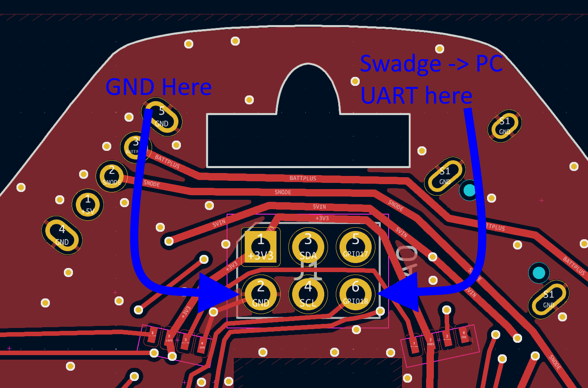

# Serial Debug Output {#serial_out}

The Swadge has three options for serial debug output which are configured by running `idf.py menuconfig`, navigating to the `Swadge Configuration` menu, and then the `Select Debug Output` menu. After the debug output option is selected, the firmware should be clean, built, and flashed as normal. The three options are as follows.

### DEBUG_OUTPUT_UART

This option will route serial debug output through the ESP32-S2's default UART pin (GPIO 43). This is exposed as SMD pad on the back of the Swadge and must be soldered to be used.

To bridge this output to a computer, a UART to USB converter must be used, like an FT232 board or an FTDI cable. Any serial terminal program, like [PuTTY](https://www.chiark.greenend.org.uk/~sgtatham/putty/latest.html) should work. When opening up the port, use the following settings:

* 115200 bits/s
* 8 bits per frame
* 1 stop bit
* no parity bit

Once the Swadge is connected, assuming everything worked, it should look something like this:

```
ESP-ROM:esp32s2-rc4-20191025
Build:Oct 25 2019
rst:0xc (RTC_SW_CPU_RST),boot:0x8 (SPI_FAST_FLASH_BOOT)
Saved PC:0x4002563a
SPIWP:0xee
mode:DIO, clock div:1
load:0x3ffe6110,len:0x1ac
load:0x4004b000,len:0x4
load:0x4004b004,len:0x9f0
load:0x4004f000,len:0x2f08
entry 0x4004b194
I (544) cpu_start: Unicore app
I (544) cache: Instruction cache        : size 8KB, 4Ways, cache line size 32Byte
I (545) cache: Data cache               : size 8KB, 4Ways, cache line size 32Byte
I (549) esp_psram: Found 2MB PSRAM device
I (552) esp_psram: Speed: 80MHz
I (774) esp_psram: SPI SRAM memory test OK
I (781) cpu_start: Pro cpu start user code
I (781) cpu_start: cpu freq: 240000000 Hz
I (781) cpu_start: Application information:
I (781) cpu_start: Project name:     swadge2024
I (786) cpu_start: App version:      v1.1.0-336-g6580f8a0
I (791) cpu_start: Compile time:     Jul 17 2024 17:56:51
I (796) cpu_start: ELF file SHA256:  a0f9cb97d9158df6...
I (801) cpu_start: ESP-IDF:          v5.2.1
I (805) cpu_start: Min chip rev:     v0.0
I (809) cpu_start: Max chip rev:     v1.99 
I (813) cpu_start: Chip rev:         v1.0
I (816) heap_init: Initializing. RAM available for dynamic allocation:
I (823) heap_init: At 3FFD7B10 len 000244F0 (145 KiB): RAM
I (828) heap_init: At 3FFFC000 len 00003A10 (14 KiB): RAM
I (833) heap_init: At 3FF9E030 len 00001FB8 (7 KiB): RTCRAM
I (838) esp_psram: Adding pool of 2048K of PSRAM memory to heap allocator
I (845) spi_flash: detected chip: generic
I (848) spi_flash: flash io: qio
I (852) main_task: Started on CPU0
I (852) main_task: Calling app_main()
I (862) USB: USB initialization
W (862) TinyUSB: The device's device descriptor is not provided by user, using default.
I (862) tusb_desc: 
┌─────────────────────────────────┐
│  USB Device Descriptor Summary  │
├───────────────────┬─────────────┤
│bDeviceClass       │ 0           │
├───────────────────┼─────────────┤
│bDeviceSubClass    │ 0           │
├───────────────────┼─────────────┤
│bDeviceProtocol    │ 0           │
├───────────────────┼─────────────┤
│bMaxPacketSize0    │ 64          │
├───────────────────┼─────────────┤
│idVendor           │ 0x303a      │
├───────────────────┼─────────────┤
│idProduct          │ 0x400c      │
├───────────────────┼─────────────┤
│bcdDevice          │ 0x100       │
├───────────────────┼─────────────┤
│iManufacturer      │ 0x1         │
├───────────────────┼─────────────┤
│iProduct           │ 0x2         │
├───────────────────┼─────────────┤
│iSerialNumber      │ 0x3         │
├───────────────────┼─────────────┤
│bNumConfigurations │ 0x1         │
└───────────────────┴─────────────┘
I (1032) TinyUSB: TinyUSB Driver installed
I (1032) USB: USB initialization DONE
I (1042) crashwrap: Crashwrap Install
W (1042) crashwrap: Crashwrap length: 36/36
W (1042) crashwrap: Last Crash: ADDR: 4008b04a FRAME: 3ffda3c0 EXCEPTION: 4
W (1052) crashwrap: Reason: LoadProhibited
W (1052) crashwrap: Description: Exception was unhandled.
W (1062) crashwrap: EXIT: 0x00000003 / PC: 0x4008b04a / PS: 0x00060b30 / A0: 0x80087671 / A1: 0x3ffda450 / SAR: 0x00000014 / EXECCAUSE: 0x0000001c / EXECVADDR: 0x00000000
E (1072) esp_timer: Task is already initialized
I (1082) CNFS: Size: 2310914, Files: 6664
I (1082) gpio: GPIO[0]| InputEn: 1| OutputEn: 0| OpenDrain: 0| Pullup: 1| Pulldown: 0| Intr:0 
I (1092) gpio: GPIO[4]| InputEn: 1| OutputEn: 0| OpenDrain: 0| Pullup: 1| Pulldown: 0| Intr:0 
I (1102) gpio: GPIO[2]| InputEn: 1| OutputEn: 0| OpenDrain: 0| Pullup: 1| Pulldown: 0| Intr:0 
I (1112) gpio: GPIO[1]| InputEn: 1| OutputEn: 0| OpenDrain: 0| Pullup: 1| Pulldown: 0| Intr:0 
I (1122) gpio: GPIO[16]| InputEn: 1| OutputEn: 0| OpenDrain: 0| Pullup: 1| Pulldown: 0| Intr:0 
I (1122) gpio: GPIO[15]| InputEn: 1| OutputEn: 0| OpenDrain: 0| Pullup: 1| Pulldown: 0| Intr:0 
I (1132) gpio: GPIO[8]| InputEn: 1| OutputEn: 0| OpenDrain: 0| Pullup: 1| Pulldown: 0| Intr:0 
I (1142) gpio: GPIO[5]| InputEn: 1| OutputEn: 0| OpenDrain: 0| Pullup: 1| Pulldown: 0| Intr:0 
I (1202) gpio: GPIO[21]| InputEn: 0| OutputEn: 1| OpenDrain: 0| Pullup: 0| Pulldown: 0| Intr:0 
I (1202) gpio: GPIO[38]| InputEn: 0| OutputEn: 1| OpenDrain: 0| Pullup: 0| Pulldown: 0| Intr:0 
```

### DEBUG_OUTPUT_UART_SAO

This option will route serial debug output through a pin on the Simple Add-On (SAO) connector (GPIO 18). It's functionally the same as `DEBUG_OUTPUT_UART`, but in a more physically accessible location. The two pins used are:



### DEBUG_OUTPUT_USB

This option will route serial debug output over the USB header. The Swadge doesn't enumerate as a regular serial port, so you must run our own serial monitor, [`swadgeterm`](../tools/swadgeterm/) to view the output. To build `swadgeterm` from the root of this repository, run:

```bash
make -C tools/swadgeterm
```

To run `swadgeterm` after building:

```bash
./tools/swadgeterm/swadgeterm
```

To do build and run in one command:

```bash
make -C tools/swadgeterm monitor
```

You should run `swadgeterm` before plugging in or powering on the Swadge. Assuming everything worked, it should look something like this:

```
PS D:\git\Super-2024-Swadge-FW> .\tools\swadgeterm\swadgeterm.exe

Waiting for USB...
Connected.
I (652) USB: USB initialization DONE
I (652) crashwrap: Crashwrap Install
W (652) crashwrap: Crashwrap length: 36/36
W (652) crashwrap: Last Crash: ADDR: 4008b04a FRAME: 3ffda3c0 EXCEPTION: 4
W (652) crashwrap: Reason: LoadProhibited
W (652) crashwrap: Description: Exception was unhandled.
W (652) crashwrap: EXIT: 0x00000003 / PC: 0x4008b04a / PS: 0x00060b30 / A0: 0x80087671 / A1: 0x3ffda450 / SAR: 0x00000014 / EXECCAUSE: 0x0000001c / EXECVADDR: 0x00000000
I (692) SPIFFS: Partition size: total: 1890281, used: 110691
I (692) gpio: GPIO[0]| InputEn: 1| OutputEn: 0| OpenDrain: 0| Pullup: 1| Pulldown: 0| Intr:0
I (692) gpio: GPIO[4]| InputEn: 1| OutputEn: 0| OpenDrain: 0| Pullup: 1| Pulldown: 0| Intr:0
I (692) gpio: GPIO[2]| InputEn: 1| OutputEn: 0| OpenDrain: 0| Pullup: 1| Pulldown: 0| Intr:0
I (692) gpio: GPIO[1]| InputEn: 1| OutputEn: 0| OpenDrain: 0| Pullup: 1| Pulldown: 0| Intr:0
I (692) gpio: GPIO[16]| InputEn: 1| OutputEn: 0| OpenDrain: 0| Pullup: 1| Pulldown: 0| Intr:0
I (692) gpio: GPIO[15]| InputEn: 1| OutputEn: 0| OpenDrain: 0| Pullup: 1| Pulldown: 0| Intr:0
I (692) gpio: GPIO[8]| InputEn: 1| OutputEn: 0| OpenDrain: 0| Pullup: 1| Pulldown: 0| Intr:0
I (692) gpio: GPIO[5]| InputEn: 1| OutputEn: 0| OpenDrain: 0| Pullup: 1| Pulldown: 0| Intr:0
I (752) gpio: GPIO[21]| InputEn: 0| OutputEn: 1| OpenDrain: 0| Pullup: 0| Pulldown: 0| Intr:0
I (752) gpio: GPIO[38]| InputEn: 0| OutputEn: 1| OpenDrain: 0| Pullup: 0| Pulldown: 0| Intr:0
```

Note that the [`reflash_and_monitor.bat`](../tools/reflash_and_monitor.bat) batch launches `swadgeterm` and assumes the firmware was compiled with `DEBUG_OUTPUT_USB`.

Also note that USB output is needs to be initialized during the startup process, so you may miss very early system debug messages before `USB: USB initialization DONE`.

## Getting Crash Information

### ESP32-S2 Output

If the Swadge crashes, the system will print crash information on the non-USB UART. This will not be printed on when using `DEBUG_OUTPUT_USB`. It will look something like this:

```
Panic has been triggered
Guru Meditation Error: Core  0 panic'ed (LoadProhibited). Exception was unhandled.

Core  0 register dump:
PC      : 0x4008b04a  PS      : 0x00060b30  A0      : 0x80087671  A1      : 0x3ffda450  
A2      : 0x00379f8b  A3      : 0x00000000  A4      : 0x3ffd2278  A5      : 0x3fff6280  
A6      : 0x3fff2b74  A7      : 0x3fff2b74  A8      : 0x00000000  A9      : 0x3ffda430  
A10     : 0x0000411a  A11     : 0x00000000  A12     : 0x00000000  A13     : 0x3f26fd28  
A14     : 0x00000007  A15     : 0x00000000  SAR     : 0x00000014  EXCCAUSE: 0x0000001c  
EXCVADDR: 0x00000000  LBEG    : 0x00000000  LEND    : 0x3f26fd28  LCOUNT  : 0x400270b0  

Backtrace: 0x4008b047:0x3ffda450 0x4008766e:0x3ffda480 0x400f2adc:0x3ffda720
```

You can interpret the backtrace with the program `xtensa-esp32s2-elf-addr2line` and the exact `elf` file that was flashed. This will print a detailed stack trace noting exactly where the crash occurred.

```bash
xtensa-esp32s2-elf-addr2line -e build/swadge2024.elf 0x4008b047:0x3ffda450 0x4008766e:0x3ffda480 0x400f2adc:0x3ffda720

/home/user/esp/Swadge-IDF-5.0/main/modes/system/mainMenu/mainMenu.c:208
/home/user/esp/Swadge-IDF-5.0/main/swadge2024.c:346
/home/user/esp/esp-idf/components/freertos/app_startup.c:208
```

### `crashwrap`

When `DEBUG_OUTPUT_USB` is used, the Swadge will save crash information when it crashes and print it the next time it boots up. It will look something like this:

```
W (1042) crashwrap: Last Crash: ADDR: 4008b04a FRAME: 3ffda3c0 EXCEPTION: 4
W (1052) crashwrap: Reason: LoadProhibited
W (1052) crashwrap: Description: Exception was unhandled.
W (1062) crashwrap: EXIT: 0x00000003 / PC: 0x4008b04a / PS: 0x00060b30 / A0: 0x80087671 / A1: 0x3ffda450 / SAR: 0x00000014 / EXECCAUSE: 0x0000001c / EXECVADDR: 0x00000000
```

You can also interpret the Last Crash ADDR with the program `xtensa-esp32s2-elf-addr2line` and the exact `elf` file that was flashed. This will print the single line where the crash occurred.

```bash
xtensa-esp32s2-elf-addr2line -e build/swadge2024.elf 0x4008b04a 

/home/user/esp/Swadge-IDF-5.0/main/modes/system/mainMenu/mainMenu.c:208
```
