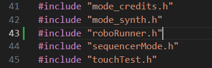

# How to make a Swadge mode

So, you've decided you want to make a swadge mode. Maybe you went to the swadge developer panel, maybe you talked to a dev, or maybe you just picked one up and wanted to know how you actually make a game for a bespoke game console.

Well, you're in the right place.

This document aims to be a full tutorial describing how to make a mode for a swadge. It will walk you through the basics, explain why you would want to pick certain options, and describes the basic loop so you can started pretty quickly.

The Swadge firmware is written in C, so knowledge of C and C-likes will be useful.

If you're ever lost, feel free to message us on slack or discord. We'd love to help you make new games!

## Prerequisites

- Some coding knowledge - This document will not teach you C. It will teach you *why* certain things are done though, and if your familiar with another language you should be able to follow along.
  - Bare minimum knowledge is what types are (bool, int, etc.) and 
  - If you want to learn how to program, [follow this link](https://www.geeksforgeeks.org/how-to-start-coding/). Coding isn't easy, but it's not very hard once you wrap your head around a few key concepts. 
- A dev environment - There's a great tutorial to set it up for Windows, Linux or MacOS [here](./SETUP.md)
- A swadge - Not strictly necessary, but sometimes things that work on the emulator don't work on the real hardware. It's best to be able to test on real hardware at the end of the day.
- A USB-C cable with data - Some cheap USB-C cables are power only. If there's no data lines, you'll have to find a different cord.
- An image editor - Presumably, you're going to want some images. MS Paint will work, but I recommend [Aseprite](https://www.aseprite.org/). You can pick up a custom palette of colors so you use the Swadge colors specifically

## Getting started

While it might be tempting to dive in and start typing, there's a step that is usually helpful in making sure you can actually finish a project.

Documentation!

I know, that stuff seems boring. But when you're writing the documentation there's a bunch of great benefits:
- Fleshing out the project: If you have a seed of an idea, Great! Maybe you want to make a block pusher, or flappy bird, or a Sonic 2 and Knuckles clone. But, what does that entail? If you're making flappy bird, you need a lot less resources than if you want to remakes even a single level of Sonic. You also need to consider each mechanic. Does your game need physics? Motion controls? Precisely timed inputs? If you write it out, you have a chance to think these things through before starting.
- Scope: Once you have the documentation, you know what you're making. It helps to know you don't need to make a food/stamina system for your block puzzler, so maybe don't add that. It also keeps the scope from becoming unmanageable due to scope creep, where the size of the project becomes impossible to comprehend. FOr larger projects, it also helps compartmentalize each task into an easier part to code.
- Remembering the project later: Sometimes, life gets in the way. If you spend a month away, having a document that tells you what you are expecting to accomplish can help.
- Collaboration: I don't know what you're making until you tell me. And, if you need art or music and want to lean on some of the helpful MAGFest folks, they're going to need to know what you're making and how they can help. If you write it all down and give it to them, they have a better chance of helping you.
- Verification: Okay, the project's done. Does it do what you wanted it to? Do the pets in your pet simulator act properly? Did you cut an entire feature for later and forget about it? Having documentation allows you to look back and check that you're happy with where you got.

If you really don't want to write documentation, you don't have to. A lot of Devs just wing it very successfully. There's a lot of truth to the "Test Early" methodology, which encourages devs to at least make a basic prototype without the bells and whistles to make sure the game is fun before writing a book's worth of documentation. It works different for different people, but if you're using this guide it's likely your first game so maybe at least jot down a few goals or concept art. It can't hurt.

Another consideration is that your grand RPG idea sucks as a first game. It's probably a really cool game, don't get me wrong, but if you spend lots of hours of coding and can't actually run or test anything because the scope is too big, it's easy to lose interest. Consider some of these games as simple starting points:
- Flappy bird
- Tic-Tac-Toe
- Chrome's Dino Jumper
- Snake
- Minesweeper
These projects don't have too much to them, but are all fun to play, right? If you start with one of these, you can get some experience with the swadge so you're not trying to figure out the swadge and an entirely new set of mechanics at the same time.

I'll be building a mode to help illustrate how everything is made, and I will in fact be remaking Chrome's dino runner!

Since I don't just want to use the Dino, I'm going to change the character to robot, and have him jumping flaming barrels and dodging swinging lamps.

### Robo Runner 

For those unfamiliar, the "Chrome Dino Game" is an endless runner that is built into Chrome browser. If you don't have internet, it automatically loads. If you don't want to turn off your internet, you can navigate to chrome::/dino instead. Go ahead and play a few rounds, just remember to come back.

Below, there are two images of the game:


The Dino automatically runs to the side once the spacebar is pressed, and obstacles start appearing from the right of the screen. The player must press the spacebar to jump over the cacti obstacles which vary in size and avoid jumping into the pterodactyls that swoop in. As the Dino runs, it accumulates a score until it collides with an object, at which point the high score is saved and the player is prompted to try again.

And, well, that's going to be my game description. It's not long, but let's break it down, shall we?

Here's some components we're going to need to make this game
- Images
  - The Robo has four images - One with either leg up, one standing still and a surprised one for when it's collided with an object
  - We'll need obstacles, like the cacti and the pterodactyl for the Dino.
  - The ground and background images need to be created
- Sounds
  - There's no background music provided, but there are sounds for when you jump. Having a little beep helps the feel of the game
- Code systems
  - Title/splash screen - It's rude to dump a player into game without warning
  - The ability to show images to the screen
  - The ability to play sounds
  - A font to write the score
  - A way to track the score
  - A way to register input for a jump
  - A way to track collisions
  - A way to spawn obstacles, and get rid of them when we're done. We also want these to not spawn too often
  - A lose screen
  - A way to move the ground and background to give the illusion of movement, speeding up as time goes on.
  - A way to save the final score, even between swadge power-offs

Even a simple game has a lot of systems that it requires to work. Some of the above are trivial to implement, as the relevant systems are already pretty much solved. Others are going to be developed entirely from scratch.

Also, did you notice the new requirement I made while writing it all out? I didn't initially indicate that the ground got faster as time went on. If I hadn't written that out, I might have forgotten to add it in. Or, we could consider it extra since it wasn't part of my initial description, so maybe it's more than I want. For now, let's keep it.

### Next steps

If you haven't already, set up your development environment, and we can move onto the next step. [Click here](./SETUP.md) to load the 'Configuring a development environment' page.

I encourage you to make this game along with me, so I will tell you what you'd need to do to follow along and describing what I'm doing.

## The Dev environment

If this is your first time using VS Code, you might be a little lost. There's a lot of cool features, but you don't need to know too much to be able to program successfully.

If you've used VS Code before, you can skip this section.

### Loading the swadge repository

If you've followed the configuration tutorial, you'll have the files you need on your computer. 

Click "File" in the top bar of VS Code, press "open folder" and navigate to the folder. By default it's under your username/esp/Super-2024-Swadge-FW/

If you've found the correct folder, the files should be shown in the side pane.

### Files


This button will show the file system of the project. Here you can see the status of the files, open or create new files, and navigate around the project.

### Extensions


Extensions provide extra functionality to VS Code. Some common ones are provide the code needed to compile the C code we're writing, spell checkers, syntax highlighters (how we get that colorful text automatically), and even tracking what we still need to get done!

Some of the extensions provided are critical to have installed, such as the C compiler. Others, such as the spellchecker, are just nice to have. if you're unsure, download all of the ones in the "recommended" tab inside the extensions bar and you'll be fine.

The recommended extensions are per-project, so if you haven't loaded the correct repository they won't show up.

### Debugging


This button leads to the debug screen. When you run your code, sometimes you'll want to stop the program mid-execution to see exactly what it's doing. When you press F5, this tab automatically opens.

### Terminal


The terminal is where you're going to interact with some of the core functions of the library. Don't worry, it's just typing. The terminal will also show you what errors you have, and can be used to provide information on how your mode is operation if you need.

Whenever there's some text that looks like the following: `make all` you can enter it into the terminal to run the command.

There's some features of the terminal that can be done with a graphic user interface (GUI) and I'll point those out when you can make a choice.

If you're in the project directory, why not try running `make all`? See what comes out.

### Useful tips

- You can drag the file tabs around to view more than one at once. You can even open the same tab multiple times 

### Useful Keybinds

- F5: Automatically saves, compiles and runs the set task, which for the swadge is to run the emulator.
- Ctrl+Shift+F5: If you've changed the code with the emulator running, you can use this key combo to restart it with the new code changes.
- Ctrl+B: Closes the side pane for more room
- Alt+Shift+A: Comment/uncomment all selected code

## Using Git

Alright, you can see the files. Can you start coding now?

Almost! First we need to learn a little bit about git. Git is a versioning software that allows multiple people to work on the same codebase without causing problems. Each individual branch can have any number of changes from the main.

Right now, we need to set up a git branch. Since this codebase is worked on by a lot of people at once, everyone creates their own branch to keep their code separate from everyone else's while it's being worked on. You start on the `main` branch, which is where the core codebase is. All projects should be created off of the main files, since that's the core everyone should be using. 

Everyone can use each branch, so you can theoretically load up someone else's branch and start working in it, but that's inadvisable. You might not know what they're doing! Similarly, others can go into your branch and look at/modify your code. It's rude to do it without permission, but it can happen. When you `git pull` from github, you'll download all changes that have been uploaded.

Your branch will contain all of your code until you eventually have it pulled into the main branch when it's done. This step is the final step, so we're not there yet.

For me, I'm going to create a 'RoboRunner' branch with `git branch RoboRunner` and then `git checkout RoboRunner` to switch to that branch. `checkout` only works when there's no changed files, so if there's anything changed I'd need to stash it away with `git stash`.

Once inside the branch, I can now make my edits without worrying about wrecking other people's code or having ours screwed up by accident!

We'll go over more commands as they become relevant, but below is an overview of a bunch of the relevant commands.

### Useful git commands

- `git status`: Shows the current status (changed files, files to be added next commit, deleted files etc.)
- `git pull`: Pulls the latest code from github. This command is good to run whenever the `main` branch updates so you can see the latest changes. Just make sure all of your changes are committed!
- `git branch <branchName>`: Creates a new branch. If you don't provide a name, it shows the list of already made branches.
- `git checkout <branchName>`: Switches to the specified branch. If you don't provide a branch name, it will tell you which branch you're on.
- `git add <file>`: Adds the selected file to the list of files to commit
- `git commit`: Saves the current state of the files. A hash is generated so you can go back to this state if you need to.
- `git merge <branchName>`: If you want to merge two branches together. Be careful, only merge other branches into yours.
- `git stash` and `git stash pop`: Stores any changes you've made. You can retrieve them by adding pop to the end as shown. Keep in mind, you may want to clear the stash with `git stash clear` occasionally, but make sure there's nothing you want inside of it first!
- `git push`: Once you have a commit, you can push the commit to the github repository if oyu have permission. You'll have to get this from the repository owner.
- `git submodule update`: The swadge repo uses some other repositories, so it's a good idea to run this command to keep them up to date on occasion. If you get errors related to CNFS it could be the submodules are out of date

### Git GUI


If you'd rather use the GUI, you can press the above button in the VS Code editor and all the same functions and more are provided. You'll have to do a little exploring, but there's a lot of cool data in there! It's also helpful when resolving merge conflicts.

## Can we code now? -  The bare minimum to compile

It's time to start writing code. Finally.

If you've been following along and run `make all` earlier you've probably already watched the program compile once. If you tried pressing F5, you probably even got the emulator up on screen. Since we've got our branch too, we can start making new files!

First, decide what kind of mode you want to make. I'm making a game so I make a new folder in `main/modes/games/` called `roboRunner`. inside this folder, I make two new files, `roboRunner.h` and `roboRunner.c`.

These two files will be where my game sits. Let's start with the .h file.

### The header file - roboRunner.h

The header file, denoted by the file extension ".h", provides the overview of the program. When looking into a new program, it helps to look at the header file first to see what the dev wants you to know about the file.

Very few files are going to be looking at this game, since it's not a library. Mostly just the main menu so that players can select this game.

```C
#pragma once
#include "swadge2024.h"

extern swadgeMode_t roboRunnerMode;
```

Very simple! 

#### \#Pragma once

`#pragma once` Tells the compiler to only make this file once. Sometimes files are used by lots of others, and if it's already been compiled, there's no reason to compile it again. All .h files should have this.

Note that some .h files have a `#ifndef _ROBORUNNER_H_` instead of `#pragma once`. It's not exactly the same, but it does the same job. We'll use pragma since it looks nicer.

#### \#include

Moving on, the `#include` finds the appropriate file and loads the data and functions from it. `swadge2024.h` provides the core swadge functionality, so that's really important to have included in the program.

#### extern swadgeMode_t mode;

Lastly, we have `extern swadgeMode_t roboRunnerMode;`. This line lets other programs that `#include` this file access the mode you're about to make. Later, we'll add this to the main menu so you can enter the mode. Obviously, the `roboRunnerMode` is a name we want other parts of the program to use to refer to our mode and should be unique. `extern` just means we're going to be providing the details in the .c file later.

Save this file, and let's move onto the .c file!

### The C file - roboRunner.c

The C file, denoted by the .c file extension, is the implementation of the mode. This is where we're going to be doing the majority of our code. As such, we're going to go more line by line, and then we'll look at the full file at the end.

#### Includes

First of all, we need to include our header file. Easy, it's just `#include roboRunner.h`. We don't need pragma, since the header file handles it.

#### Mode name

Next, we're going to make the string that is used to display the game's name in the menu. 

`const char runnerModeName[] = "Robo Runner";`

Let's break it down real quick:
- const: This can't be changed
- char: This is a character, not an integer or something else
- runnerModeName: This is how we'll find this string later in the codebase.
- []: Denotes an array. In this case, each letter takes one character so we need an array to hold all of them
- "Robo Runner": The text we actually want. Use double quotes around it.
- ; - Denotes the end of a statement. We usually only put one per line.

Setting this to const saves this into the program memory, which is a lot larger than RAM. We'll get into memory management very briefly later. For now, know that it's usually better to put text strings in this format than to leave them directly in the code.

#### Function declarations

Now we need to add the three main function declarations. Functions and function declarations are different; The declaration provides the pattern and the function provides the implementation.

If we had functions other parts of the program would be using, the declarations would go in the .h file, since users of the file would need to see them. Functions internal to the .c file can be declared in the same file as the declaration.

Here's the three functions we're going to declare:
- `static void runnerEnterMode(void);`: This function is called when the mode is entered.
- `static void runnerExitMode(void);`: THis is called when the mode is exited, used to clean up the mode.
- `static void runnerMainLoop(int64_t elapsedUs);`: This is the code that gets called in a loop. All of the actual gameplay code needs to be in here.

Some notes:
- `static` means that this item is only available inside this file. This is good practice, we don't want other people to accidentally use your variables or functions.
- `void`: THis is the value the function returns. In this case, it's nothing, or void, for all three.
- `runnerEnterMode()`: This is a function name and declaration. When we want to use this function later, this is what we need to type.
- `int64_t elapsedUS`: This is an argument. If a function doesn't need arguments, you can put void in as well. The specific argument being passed is the number of microseconds since the last time the loop functions was called. It's very useful, and you're required to have it.

Something to note: These aren't strictly necessary. C is read from the top of the file down by the compiler, and as long as it finds each function before it's used, there won't be issues. However, forward declaring them means the compiler knows that the functions are around *somewhere* so it don't throw an error when it doesn't recognize it. Think of it like telling someone not to worry, everyone is fine before describing a car accident.

#### SwadgeMode_t

Remember we made that `extern swadgeMode_t` in the .h file? Time to actually define it. We promised the compiler we would.

The `swadgeMode_t` struct allows us to define the behavior of the mode. This is where we set what peripherals we want to use and tell the rest of the program to use our enter, exit and loop functions. 

We'll look at the structure and what each option means.

```C
swadgeMode_t roboRunnerMode = {
    .modeName                 = runnerModeName, // Assign the name we created here
    .wifiMode                 = NO_WIFI,        // If we want WiFi 
    .overrideUsb              = false,          // Overrides the default USB behavior.
    .usesAccelerometer        = false,          // If we're using motion controls
    .usesThermometer          = false,          // If we're using the internal thermometer
    .overrideSelectBtn        = false,          // The select/Menu button has a default behavior. If you want to override it, you can set this to true but you'll need to re-implement the behavior.
    .fnEnterMode              = runnerEnterMode, // The enter mode function
    .fnExitMode               = runnerExitMode,  // The exit mode function
    .fnMainLoop               = runnerMainLoop,  // The loop function
    .fnAudioCallback          = NULL,           // If the mode uses the microphone
    .fnBackgroundDrawCallback = NULL,           // Draws a section of the display
    .fnEspNowRecvCb           = NULL,           // If using Wifi, add the receive function here
    .fnEspNowSendCb           = NULL,           // If using Wifi, add the send function here
    .fnAdvancedUSB            = NULL, // If using advanced USB things.
};
```

Our game is simple; we're using very few of the functions. That's fine though, just knowing that the options are there is good. If we decide to make the robot overheat so you need to throw the swadge into the fridge, we can always set the thermometer to true in the future when we need it.

#### Functions

So, we've finished telling the swadge what it needs to know to use our mode. We've got one final step until we're done with the .c file. We need to add the functions.

```C
static void runnerEnterMode()
{
}

static void runnerExitMode()
{
}

static void runnerMainLoop(int64_t elapsedUs)
{
}
```

Seems pretty similar to the declarations, right? Instead of the semicolon we have curly braces, and we don't need to include the `void` inside the parens. 

The names need ot be identical, and the `elapsedUs` needs to be the same, or else the compiler won't realize that these are the same functions and bind them.

If we decided not to forward declare these, then the `swadgeMode_t` struct wouldn't know what a `runnerEnterMode` was and would throw an error.

#### The full .c file

```C
#include "roboRunner.h"

const char runnerModeName[] = "Robo Runner";

static void runnerEnterMode(void);
static void runnerExitMode(void);
static void runnerMainLoop(int64_t elapsedUs);

swadgeMode_t roboRunnerMode = {
    .modeName                 = runnerModeName,
    .wifiMode                 = NO_WIFI,
    .overrideUsb              = false,
    .usesAccelerometer        = false,
    .usesThermometer          = false,
    .overrideSelectBtn        = false,
    .fnEnterMode              = runnerEnterMode,
    .fnExitMode               = runnerExitMode,
    .fnMainLoop               = runnerMainLoop,
    .fnAudioCallback          = NULL,
    .fnBackgroundDrawCallback = NULL,
    .fnEspNowRecvCb           = NULL,
    .fnEspNowSendCb           = NULL,
    .fnAdvancedUSB            = NULL,
};

static void runnerEnterMode()
{
}

static void runnerExitMode()
{
}

static void runnerMainLoop(int64_t elapsedUs)
{
}
```

Now that this is done, we can move onto getting this compiled!

### Compiling

Now that we've got our code, let's make sure it runs!

First, let's hit F5. If the emulator pops up, great! No errors are preventing it from compiling. If you are encountering errors, see "Include Errors" and "Debugging" below.

Assuming it works, you can look around a bunch. Of course, you might be surprised to find your mode isn't in the menu. We still haven't properly added that, so let's do that now.

#### Include errors

Sometimes there's an error where VS Code doesn't recognize all of the #includes, known as an include error. If this happens, try running the following and restarting your VS Code after saving all the files. Don't worry, VS Code will load the repo and all your tabs right back open. This doesn't stop it from compiling, but the red may hide more serious errors, so it's best to get rid of them.

The solution appears to be compiling with the idf, so follow the instructions for building the program for the swadge (idf.py) below and it should get fixed.

#### Debugging

So, something is broken. You can tell because when you try to run the emulator it flashes before disappearing, or it just never compiles.

Fear not, the computer is trying to help you figure this out, believe it or not. 

First, check the problems tab above the terminal. It should have a list of compile time errors, or errors that the compiler can catch before you even build the program. Make sure you solve all of these before trying to compile. 

Once those are gone, if you compile and still get an error, you should be able to see some error messages in the terminal.

Pay attention to what the computer tells you in error messages. It will usually provide you a file, a line in that file, what it was trying to do and what the specific error was.

If all else fails, try searching the error message on the internet, or contact the rest of the swadge team on discord or slack.

#### Adding the mode to the menu

Now, we're going to have to modify a few other files. Fortunately, only two more for now.

First up, we need to tell the other modes about our mode. Open `main/modeIncludeList.h` and add our header file to the list of includes. 



Next, open `main/modeIncludeList.c` and add the following:
- Inside the `allSwadgeModes[]` list, add `&roboRunnerMode,` at the end of the list before the end curly brace.
- Add `addSingleItemToMenu(menu, roboRunnerMode.modeName);` inside one of the submenus. Whichever submenu you put this in is where it'll be in the main menu.


Now, we can recompile and load the emulator with F5 and we'll be able to navigate to the mode and load into it!


Congrats! The mode is running. It's just not doing anything, since we didn't actually provide any code for it to execute. We didn't even give it any way to handle input, so we can't even get out o fit, we just need to close it down. But, it works!

#### idf.py

Now that the emulator works, let's make sure we can compile it to load onto a physical swadge.

We can use the following commands to build the program for the swadge.

- Windows: `.\..\esp-idf\export.ps1`
- Linux/MacOS: `source ./../esp-idf.sh`

After that command completes, run `idf.py build`.

It should fail. Why? The idf doesn't know about these new files we made. See, there's two build systems included in this project, one for the emulator and one for the swadge hardware. The emulator uses `make` and the swadge uses `CMake` via `idf.py`. `Make` is able to find the files as long as they're inside the project, but we need to tell `CMake` where the files are.

Inside `main/CMakeLists.txt` you'll see two big lists: SRCS and INCLUDE_DIRS. In SRCS, add any .c files you have. In INCLUDE_DIRS, include all directories you've made. THis tells CMake to look inside this folder for files and sub folders, so if you forget to add them you're not going to be able to build the program.


Save the file, and let's try again. You should see a prompt telling you how to flash a swadge now.

Congrats! you now have a working mode.

### Initial commit and pushing

Now that we have something working, lets save it so if we break it in the future we can come back here and not have to rebuild everything.

It's good practice to commit your code after a feature goes in. We're going to be making a bunch of features in this mode, so we're going to commit each one so we can revert or check that the functionality isn't changing. If you get into the habit of only working on one part of the system and committing each time, it'll make returning to find and fix bugs a lot easier later.

However, you should bundle like items into a commit. While I could make a commit for each file, that's a lot of work and until all of them are done the program isn't going to work anyway.

First, I'll run `git status` to see what's currently going on.

```
On branch RoboRunner
Changes not staged for commit:
  (use "git add <file>..." to update what will be committed)
  (use "git restore <file>..." to discard changes in working directory)
        modified:   main/CMakeLists.txt
        modified:   main/modeIncludeList.c
        modified:   main/modeIncludeList.h

Untracked files:
  (use "git add <file>..." to include in what will be committed)
        main/modes/games/RoboRunner

no changes added to commit (use "git add" and/or "git commit -a")
```

Alright, so we've got three modified files. These are the ones we changed to add our mode to the menu and get `idf.py build` to compile. The other files are untracked, since they're brand new. We need to add all of these to the commit.

``` bash
git add main/CMakeLists.txt
git add main/modeIncludeList.c
git add main/modeIncludeList.h
git add main/modes/games/RoboRunner/*
```

If you add "*" you will include all the files inside that folder. If the status command only lists files you want in the commit, you can just run `git add *` and it'll grab all files. Just be careful you didn't accidentally change other files first.

Now you can run `git status` again and verify all the files you want are added, and the ones you don't want aren't included. You can start over with `git reset` if you accidentally added the wrong files.

Once you're satisfied with the file list, run the following command: `git commit -m "Initial Commit"` This will add the message to the commit so you don't have to memorize a hash to come back. THe message should be as descriptive as required, such as "misc bug fixes" or "Added blowing on microphone to jump". If you're writing paragraphs, you probably need to commit more.

The last step can only be done if we have write access to the github repository. If oyu have access, you can push to the external repo, saving your code outside you computer so other devs can work on it and if your computer dies you'll be able to pull the files back down.

Run `git push --set-upstream origin RoboRunner` to create the branch on the github server and send the files to it. You will have to log in.

If successful, your code is now saved to the cloud and can be pulled to a different computer! 

We've done a lot of work and all we've got to show for it is a blank black screen, so in the next section let's give ourselves something to look at, hmm?

## Loading resources

In this section, we're going to draw something to the screen. 

First, we need to make an image to display. I'm going to make the little robot that's gonna do the running. I prefer to use Aseprite to make images, and here's the result!


Did I mention I don't do art? I don't do art. Still, it's better to have this guy than nothing. 

If you're following along feel free to use any other small PNGs or make your own. They don't need to be perfect, just something to see what's going on. Don't worry about quality, making programmer art is a time honored tradition among game developers. Remember, if you make something fun and want better art, we have artists who love to help work on the games we make. You can ask for their help, or help from other people in your circle who like to make art. Swadeg games are collaborative, so don't be shy!

Some notes:
- The swadge color palette can be found [here](./SwadgePalette.gpl). The swadge will crunch down other colors to closest match, but for better control, you can use this subset of colors to ensure it looks the same as originally designed if using Aseprite
- The Swadge's screen was 280 wide x 240 tall for at least '23 through '25. This isn't that large, so a super detailed 1000 pixel square character isn't going to fit.
- The Swadge's screen is pretty small in reality. The emulator's screen will make them a lot larger which is good for debugging but can foll your brain into thinking that's the end size.
- images that are too large will not load. It has to do with memory size, not just pixel size, so there's no specific limit. Just keep the files a reasonable size and it'll be alright.

All art and sounds go into the `assets/` folder in the repository. Make a new folder and copy all the assets into it. During compilation, they will be converted automatically to a format the swadge can use.

### Memory 

Now that I have some basic art, we can see about getting it into the Swadge. The Swadge has limited RAM, so each mode has to allocate and de-allocate RAM whenever the mode is entered or exited. We can't afford to have everything loaded all the time. If you recall use making the mode name up above, this is the reason we made it `const` so the bytes aren't taking up space in RAM.

The easiest way to make sure the RAM is properly managed is to put all the variables into a "mode struct", or a simple data structure that will contain all the data as we can load and de-load it easily.

```C
typedef struct 
{
    wsg_t character;
} runnerData_t;
```

The above code creates a struct called runnerData_t with one member, that of a wsg_t called character. Anytime we use typedef, we are defining a new type, so we add "_t" to the end so we know what it is later. You'll note that the member, "wsg_t", is also a type.

Of course, we don't know what that is, so let's look that up, shall we? One of the most important skills in game development is being able to read the technical documentation. Right now, we have no idea what this wsg thing is but it's certainly valid code.

If you navigate to [The documentation](https://adam.feinste.in/Super-2024-Swadge-FW/index.html) you'll find a lot of useful information. It's all generated directly from the code, so we can be sure it's up to date with the `main` branch. Here, we can go find the wsg.h file and figure out what it's used for.

Turns out, it's our image handler. Pretty easy to get from context, but anytime there's something you want to know about, look it up in the documentation. In fact, maybe set aside some time to look through random bits of the library. See how other modes were built, look at the functions. This will help you figure out what the other devs have worked and how everything is organized. It's a good idea to bookmark it for easy browsing later.

Well, now that we have our struct, we need allocate space and keep a reference to the memory space. We can accomplish this by first creating a pointer right after the swadgeMode_t struct:

```C
runnerData_t* rd;
```

And then by changing the enter mode function to the following:

```C
static void runnerEnterMode()
{
    rd = (runnerData_t*)heap_caps_calloc(1, sizeof(runnerData_t), MALLOC_CAP_8BIT);
}
```

That's a lot, but here's the breakdown:
- heap_caps_calloc() allocates memory. This tells the swadge or emulator to make space for the data we're going to save.
- The arguments:
  - 1: The number blocks of memory to initialize. We only need one copy of runnerData_t, so 1.
  - sizeof(runnerData_t): This automatically gets the size of runnerData_t. If we add thirty more "wsg_t"s, this will automatically ensure the memory picked up is the right size.
  - MALLOC_CAP_8BIT: This is a mode thing. Unless it breaks, just use this.
- (runnerData_t*): The memory that heap_caps_calloc() assigned to us isn't typed, it's just a bunch of holes to fill numbers into. This snippit of code tells the compiler that memory we just allocated fits into rd
- rd: A pointer to the memory we've just allocated.

So, pointers. It's not complicated, but when you're unfamiliar it does seem overwhelming. A pointer is an address to a value. Think of it like a mailbox. The mailbox contains the value, whether it's a single true/false or an entire swadgeMode_t struct. THe pointer is the number on the side of the mailbox. Sometimes it's a lot easier to say "grab whatever's in mailbox 20" instead of describing each part of the data inside the mailbox.

In our case we're doing this because we don't actually know which mailbox out runnerData_t is assigned to. What we do know is that whatever that mailbox ends up being we've stored the number inside `rd`. 

So, `rd` contains an address. We don't really care where, just that it exists. Great.

There's one more thing we need to do to avoid breaking the program. Right now, we've allocated the data, but we haven't freed the space for other programs to use once we're done.

We can accomplish this by changing the exit mode function like so:
```C
static void runnerExitMode()
{
    free(rd);
}
```

This will de-allocate the memory.

### Images, finally

Now we're going to allocate memory for the WSG. All assets (images, fonts and sounds) need to be allocated and de-allocated just like individual blobs of memory.

Remember, the order of allocating memory matters! If item X contains item Y, and we free item X before Y, the program doesn't know how to access Y anymore and we cause memory leaks. Also, we can't allocate for Y if X isn't already allocated.

The two new functions we need are easy to find in the documentation, so if you checked it out you've probably already seen them.

FIXME: We're moving to a new way of loading assets. Update.

```C
loadWsg("RoboStanding.wsg", &rd->character, true);
freeWsg(&rd->character);
```

`rd->character` is how we point specifically to the character image inside the rd struct. We know rd is a pointer, so it points to the data. 

The ampersand "&" symbol means "grab the data inside the mailbox, not the number on the side of the mailbox". Conversely, an asterisk "*" indicated that you want the number of the mailbox instead of the data you're looking at, a pointer.

The "RoboStanding.wsg" is the name of the file, but with `.png` replaced by `.wsg`. This is done automatically by the program at compilation time, so you don't have ot do it by hand.

Lastly, that last `true` at the end of the load function tells the swadge which RAM to put the image into. When in doubt, leave it on true, as this will load it into SPI RAM. SPI RAM is slower, but a lot more plentiful.

Given we know that rd needs to be allocated, we need to put the `loadWsg()` function after the `heap_caps_calloc()` and the `freeWsg()` before the `free(rd)` functions. 

```C
static void runnerEnterMode()
{
    rd = (runnerData_t*)heap_caps_calloc(1, sizeof(runnerData_t), MALLOC_CAP_8BIT);
    loadWsg("RoboStanding.wsg", &rd->character, true);
}

static void runnerExitMode()
{
    freeWsg(&rd->character);
    free(rd);
}
```

Now, the wsg is loaded and we can actually start to use it!

In the main loop function, add `drawWsgSimple(&rd->character, 32, 184);`

We pass in three arguments:
- &rd->character: The address of the wsg inside rd->character
- x Offset: How many pixels across the screen from left to right the image is drawn at
- y Offset: How many pixels from top to bottom the image is offset by

The Swadge draws images assuming the top left corner is the start. For our example, the top left corner will be located at 32 pixels across, 32 pixels down resulting in the following once we press F5 and load up the new mode:


Some things you'll note if you start to play with the numbers is that the corners of the screen are obscured. This is because the real screen we're using has rounded corners. The shrouded portions are roughly equivalent to the real screen. Another thing to note is that the last time the pixel is updated is what's going to be drawn. SO if you want to draw text over a textbox, the box needs to be drawn first or the box will overwrite the text.

Next, we'll add some ground to stand on

Before the function drawing the sprite, add the following line: `drawLine(0, 184, TFT_WIDTH, 184, c555, 0);`
- `drawline()`: Draws a line as defines by the first four numbers
- `TFT_WIDTH`: This is a Macro. Macros will be explained later, but this one is just eh value 280, which is the width of the swadge screen in pixels.
- `c555`: The swadge color palette uses this notation. c555 is white, c000 is black.
- The last zero is dash width. We don't want our ground line to be dashed, so zero.

If you look into the documentation for drawLine() (shapes.h) you can see that if you specify the start x and y and the end x and y you can draw the line. We set both Y values to 184 since that seems about right, but the X values are on opposite sides of the screen (0 and 280). This draws a white line directly across the screen.

Play with the colors (try c500, c050, c005, and c123) and the x and y positions on either end and watch how the line moves. Make sure to save the file before reloading the emulator!

If you place teh draw line function after the `drawWsg()` you'll notice the line draws on top of the robot, which definitely looks wrong. Remember, draw order matters. 

Right now, we're drawing the robot standing in the same place every frame, which is boring. Let's get some actual movement on screen!

### Final code for this section

```C
#include "roboRunner.h"

const char runnerModeName[] = "Robo Runner";

typedef struct 
{
    wsg_t character;
} runnerData_t;

static void runnerEnterMode(void);
static void runnerExitMode(void);
static void runnerMainLoop(int64_t elapsedUs);

swadgeMode_t roboRunnerMode = {
    .modeName                 = runnerModeName,
    .wifiMode                 = NO_WIFI,
    .overrideUsb              = false,
    .usesAccelerometer        = false,
    .usesThermometer          = false,
    .overrideSelectBtn        = false,
    .fnEnterMode              = runnerEnterMode,
    .fnExitMode               = runnerExitMode,
    .fnMainLoop               = runnerMainLoop,
    .fnAudioCallback          = NULL,
    .fnBackgroundDrawCallback = NULL,
    .fnEspNowRecvCb           = NULL,
    .fnEspNowSendCb           = NULL,
    .fnAdvancedUSB            = NULL,
};

runnerData_t* rd;

static void runnerEnterMode()
{
    rd = (runnerData_t*)heap_caps_calloc(1, sizeof(runnerData_t), MALLOC_CAP_8BIT);
    loadWsg("RoboStanding.wsg", &rd->character, true);
}

static void runnerExitMode()
{
    freeWsg(&rd->character);
    free(rd);
}

static void runnerMainLoop(int64_t elapsedUs)
{
    drawLine(0, 184, TFT_WIDTH, 184, c555, 0);
    drawWsgSimple(&rd->character, 32, 184);
}
```

## Input

Let's get the jumping ability coded. Since the obstacles come to us, we just need to jump up and then fall down. The robot can only jump when on the ground. We'll allow the player to press either the A button or the up button to jump, and we want the robot to have a graceful arc. 

An improvement to game feel might be to vary the height of the jump based on the length of the button press, but that's more than we described above. Maybe we'll fit it in later.

### Basic input

We're going to start to accept inputs now. Update the main loop to look like the following:

```C
static void runnerMainLoop(int64_t elapsedUs)
{
    buttonEvt_t evt;
    while (checkButtonQueueWrapper(&evt))
    {
        if (evt.down)
        {
            if (evt.button & PB_A || evt.button == PB_UP)
            {
                // We'll add code here in the next part
            }
        }
    }
    drawWsgSimple(&rd->character, 32, 32);
}
```

Here's a breakdown of the parts of the input:
- `buttonEvt_t evt;`: Creates a event struct. this contains a single button state at a time
- `checkButtonQueueWrapper()`: The swadge has an internal buffer for buttons. This takes the next button and sets the event (passed as an argument) to the state the button is at.
- `while(){}`: The while loop continues to execute until `checkButtonQueueWrapper()` returns false because there's no more buttons pressed.
- `if(){}`: If the contained statement is true, execute the code inside the curly braces.
- `evt.button & PB_A || evt.button == PB_UP`: This is an expression that evaluates to true or false.
  - `evt.button & PB_A`: If the A button is pressed, value is set to true
  - `evt.button == PB_UP`: If the up button is pressed, value is set to true
  - `||`: Logical OR. Basically, if the left hand side is true OR the right hand side is true, the whole thing is true.
- `rd->jumped`: This is the most important part, this is where we tell the rest of the mode that we just jumped in the air.

You'll note that when checking if the button is A we used a single ampersand and for checking the up button we used "==". Both work, it's a matter of preference. I prefer the ampersand.

### Jumping robots

Now we know if the player has pressed buttons, but we need to define what it means to jump. Obviously, we're going to want to see the robot jump, and that involves moving on the Y-axis (up and down), so we're going to need to track the Y position. We're also going to need to know what speed the robot is going, and whether it's up or down. Lastly, we're going to need to know if the robot is on the floor.

This is three variables: Y position, Y speed and on Ground. Y position is where the robot is in space, the Y speed is how fast he's moving, and on ground tells us if the robot can jump again. After all, he's using his little legs, not a jetpack.

Modify the runnerData_t struct to look like this:
```C
typedef struct
{
    // Assets
    wsg_t character;

    // Robot
    bool onGround;
    int ySpeed;
    int yPos;
} runnerData_t;
```

This will allow us to save this data between frames. You access it the same way you did with the wsg, so I'm not going to point it out anymore. Now we need to decide what to do with these variables.

First of all, change the `128` in `drawWsgSimple()` to `rd->yPos`. We want the image to follow the height we give to it. Right now `rd->yPos` starts at 0, so it'll draw the sprite at the top of the screen.

Next, we want to change the speed. After the input while loop, add the following:

```C
rd->yPos += rd->ySpeed;
rd->ySpeed += 1;
```

The first line adds the current speed to the robot. The second line increases that speed every frame. It's adding 1 because y increases in the downward direction, so this acts like gravity.

`+=` is a shortcut. Expanded out, this looks like `rd->yPos = rd->yPos + rd->ySpeed;`. This is the convention since it matches how CPUs actually handle the data, but it's a lot less text to type out if we use `+=`. There's no difference to the computer at the end of the day, so don't stress out about it.

Lastly, let's add something into the input loop. Add `rd->ySpeed = -12;`. It's negative because we want to go up, and -Y is up. You'll note we don't use `+=` here, and that's because we don't care what the value used to be, we want it to be -12 when we hit the key.

Let's hit F5!


Well, that's not right.

If you restart the program and spam the jump key, you'll see that the robot can actually stay in frame if oyu jump fast enough. Congratulations, we've just made flappy robot. Seeing as that's not the goal, let's take an inventory of the issues:
- The robot never stops falling
- The robot can jump in the air
- The swadge just draws over the previous frame, resulting in a series of images instead of what you'd expect.

We'll tackle the visuals first.

#### Sidebar - Get rid of overdraw

The Swadge doesn't automatically refresh the screen, as it turns out. Any pixels not updated from the last frame will remain the same. This could be used to optimize things if the mode is very, *very* constrained, but in general we can just redraw everything each frame. 

In our case, we're already drawing everything we want each frame, so all we need to do is clear the screen.

Add a simple `fillDisplayArea(0, 0, TFT_WIDTH, TFT_HEIGHT, c001);` before the line and wsg draw lines. If you want to, you can change the color to see which you like best. This function draws from the top left corner (0, 0) to the bottom right corner, (TFT_WIDTH, TFT_HEIGHT) in the color chosen. Since it'll write over every pixel, the only things we'll see on the next frame are whats drawn that frame.

#### Back to fixing

Really, we should have seen it coming. We didn't use onGround, so obviously it's not going to work!

Change the `(evt.button & PB_A || evt.button & PB_UP)` to `((evt.button & PB_A || evt.button & PB_UP) && rd->onGround)`. The parenthesis are import for grouping here, so make sure you get it right. Whatever is inside the innermost set of parenthesis will evaluate first, and we want that to the button check. If either of the buttons are pressed, we can check if we're ont eh ground. `&&` is the logical AND operation, so what just told the program is: "If a or up is pressed, and the character is on the ground" you can add the negative speed.

If we run the program now, all we've managed to accomplish is stopping the double jumps. This is because we've never set onGround to true, so we can't ever jump. Instead of doing an actual collision check, let's just use where the robot is on the screen to determine if it should be on the ground or not.

We can add the following check after setting the ySpeed to += 1:
```C
if (rd->yPos > 128)
{
    rd->onGround = true;
}
```
And after we set the ySpeed to -12, we can add a single line: `rd->onGround = false;`

Now the robot will know it's hit the ground if it's low enough on the screen, but we still haven't stopped it entirely. Right now, the speed keeps accumulating and the robot keeps falling.

Inside the new if loop, we can add two more lines to make the robot behave as we want:
```C
rd->yPos     = 128;
rd->ySpeed   = 0;
```
Setting the position to 128 means that it doesn't matter exactly how far the robot fell below the ground, we'll snap it back to the level of the floor (which I have determined through trial and error is 128 pixels down the screen) and set the speed to 0.

Technically, we don't need to set the speed to 0, but if we don't and we wait long enough the integer will overflow to a massive negative number and the robot will go shooting into the sky. We'd have to wait roughly nine minutes at 60FPS, and it would just look like the robot disappears since it'll be moving so fast. It's good practice though, so let's do it.

An interesting experiment is to only set the speed to 0. The robot gets stuck below where we wanted him to on the floor. He overshot on the initial fall from the top of the screen and since we're not resetting him to the ground, he just stays down there. If we set yPos at the start of the program, we could avoid needing this line entirely! I'll leave it though, since it works fine.

Now the robot should jump as expected!

### Macros and Magic Numbers

I promised to tell you about macros, and here's where I'm doing that. 

Macros are a "preprocessor" step, which means the compiler moving things around before actually compiling your code. Sounds scary, and if used incorrectly it causes all sorts of problems. So then, why tempt fate and use them?

Because they can be very useful in getting rid of magic numbers, that's why. Right now, we have plenty of magic numbers, or numbers that we just put in without saying how we got them.
- Jump height: -12
- ySpeed increase each frame: 1
- height on screen before onGround is set to true: 128
- Ground line draw height: 184
- Player distance from the left of the screen: 32

The code works the way we have it, but what if you want to raise the height of the ground line by one pixel? You have to change it in several places. Or, we could forget what -12 means. Or, what if we don't know how wide the screen is?

Remember, we used TFT_WIDTH and TFT_HEIGHT before. We didn't make these, someone else did. Presumably, if the screen size is changed, we can assume that these Macros are being change appropriately, so we don't suddenly find our code doesn't work because the screen is 32 pixels wider or something. It also helps us as devs since we don't need to remember how wide the screen is, we can just grab the number.

In the same way, we can define our own Macros to provide us with an easy way to tweak the program, and recall what the value is.

At the top of the file, just under the `#import` statement, let's add the following lines:
```C
#define JUMP_HEIGHT          -12
#define Y_ACCEL              1
#define GROUND_HEIGHT        184
#define PLAYER_GROUND_OFFSET (GROUND_HEIGHT - 56)
#define PLAYER_X             32
```
This will allow us to use the tags we've written to replace the magic numbers. Go back through the file and replace the numbers with teh Macros.

Note that you shouldn't be replacing every value. 0, for instance, isn't the same value in all instances. Sometimes it's the initial x or y coordinate, sometimes it's the length of the dashed line. If we had two numbers that were both 32, but only one of them relates to the player, we don't want to adjust the player and this other number when we're not expecting to.

In addition, obvious numbers don't need to be included. We don't want dashed lines, but since the function requires it, we're just going to put a 0 in there. We don't care what it is, it works and we're never going to adjust it.

### Completed section code

Now that we've put int he Macros, the code should look similar to this:
```C
#include "roboRunner.h"

#define JUMP_HEIGHT          -12
#define Y_ACCEL              1
#define GROUND_HEIGHT        184
#define PLAYER_GROUND_OFFSET (GROUND_HEIGHT - 56)
#define PLAYER_X             32

const char runnerModeName[] = "Robo Runner";

typedef struct
{
    // Assets
    wsg_t character;

    // Robot
    bool onGround;
    int ySpeed;
    int yPos;
} runnerData_t;

static void runnerEnterMode(void);
static void runnerExitMode(void);
static void runnerMainLoop(int64_t elapsedUs);

swadgeMode_t roboRunnerMode = {
    .modeName                 = runnerModeName,
    .wifiMode                 = NO_WIFI,
    .overrideUsb              = false,
    .usesAccelerometer        = false,
    .usesThermometer          = false,
    .overrideSelectBtn        = false,
    .fnEnterMode              = runnerEnterMode,
    .fnExitMode               = runnerExitMode,
    .fnMainLoop               = runnerMainLoop,
    .fnAudioCallback          = NULL,
    .fnBackgroundDrawCallback = NULL,
    .fnEspNowRecvCb           = NULL,
    .fnEspNowSendCb           = NULL,
    .fnAdvancedUSB            = NULL,
};

runnerData_t* rd;

static void runnerEnterMode()
{
    rd = (runnerData_t*)heap_caps_calloc(1, sizeof(runnerData_t), MALLOC_CAP_8BIT);
    loadWsg("RoboStanding.wsg", &rd->character, true);
}

static void runnerExitMode()
{
    freeWsg(&rd->character);
    free(rd);
}

static void runnerMainLoop(int64_t elapsedUs)
{
    // Check input
    buttonEvt_t evt;
    while (checkButtonQueueWrapper(&evt))
    {
        if (evt.down)
        {
            if ((evt.button & PB_A || evt.button & PB_UP) && rd->onGround)
            {
                rd->ySpeed   = JUMP_HEIGHT;
                rd->onGround = false;
            }
        }
    }

    // Update player position
    rd->yPos += rd->ySpeed;
    rd->ySpeed += Y_ACCEL;
    if (rd->yPos > PLAYER_GROUND_OFFSET)
    {
        rd->onGround = true;
        rd->yPos     = PLAYER_GROUND_OFFSET;
        rd->ySpeed   = 0;
    }

    // Draw screen
    fillDisplayArea(0, 0, TFT_WIDTH, TFT_HEIGHT, c001);
    drawLine(0, GROUND_HEIGHT, TFT_WIDTH, GROUND_HEIGHT, c555, 0);
    drawWsgSimple(&rd->character, PLAYER_X, rd->yPos);
}
```
If you want, try playing with the macro values to find something you like. 

Now that we've started to get a handle on things, this tutorial will move a little faster. 

## Obstacles

Now that we can jump to avoid obstacles, let's add some obstacles to avoid.

We're going to have two obstacles: One for the top of the screen to make sure you're not jumping and one on the bottom to force you to jump.

First, let's make a new struct for the obstacle.

#### Geometry.h

```C
typedef struct
{
    rectangle_t rect; // Contains the x, y, width and height
    wsg_t img;        // Image to display
    int speed;        // Speed of the obstacle
} obstacle_t;
```

`rectangle_t` is from the geometry library, which we don't have included yet. It's easy, just add `#include "geometry.h"` near the top of the file. The errors should go away as soon as VS Code catches up. The geometry library has functions for checking collisions, so that's going to be useful going forward. If you want specifics, check out the file.

#### Refactoring

Next, let's refactor the player to allow for collisions. Refactoring is converting code from one format to another, theoretically without changing the functionality. Moving where code is for clarity, removing unnecessary code, stuff like that. The data saved in the runnerData_t struct can all be moved to a player struct. This will keep all the relevant data together. In addition, we're going to use rectangle_t to provide the yPos instead of the current variable, since it's otherwise a duplicate.

The struct section should look a lot like this now.

```C
typedef struct 
{
    rectangle_t rect; // Contains the x, y, width and height
    wsg_t img;        // The image
    bool onGround;    // If the player is touching the ground
    int ySpeed;       // The vertical speed. negative numbers are up.
} player_t;

typedef struct
{
    rectangle_t rect; // Contains the x, y, width and height
    wsg_t img;        // Image to display
    int speed;        // Speed of the obstacle
} obstacle_t;

typedef struct
{
    // Robot
    player_t robot;

    // Obstacles
    obstacle_t obstacles[2];
} runnerData_t;
```

In the runnerData_t, we're now storing one copy of the robot and two copies of the obstacle. This is another magic number we can change to a Macro. I'll leave that as an exercise for the reader.

Now that we've refactored, there's a lot of red. Let's start converting them.
- `&rd->character` becomes `&rd->robot.img`
- `rd->onGround` becomes `rd->robot.onGround`
- The most complicated on is yPos, which goes from `rd->yPos` to `rd->robot.rect.pos.y`
The rest should be evident. Once you're done, hit F5 to make sure that the code still runs as expected.

While we're refactoring, let's also break out some of the code into more functions. Keeping the draw calls in the same place will come in handy later, as well as handling the logic updates separately.

Make new function declarations near the top like this:

```C
static void runnerLogic(int64_t elapsedUS);
static void draw(void);
```

We're not using the elapsedUS right this moment, but we're probably going to need to soon. Cut the drawing functions and add them to the draw function, then add the draw function tot he end of the loop. Do the same with the plater logic as well.

```C
static void runnerMainLoop(int64_t elapsedUs)
{
    // Other code...

    // Update player position
    runnerLogic(elapsedUs);

    // Draw screen
    draw();
}

static void runnerLogic(int64_t elapsedUS)
{
    rd->robot.rect.pos.y += rd->robot.ySpeed;
    rd->robot.ySpeed += Y_ACCEL;
    if (rd->robot.rect.pos.y > PLAYER_GROUND_OFFSET)
    {
        rd->robot.onGround   = true;
        rd->robot.rect.pos.y = PLAYER_GROUND_OFFSET;
        rd->robot.ySpeed     = 0;
    }
}

static void draw()
{
    fillDisplayArea(0, 0, TFT_WIDTH, TFT_HEIGHT, c001);
    drawLine(0, GROUND_HEIGHT, TFT_WIDTH, GROUND_HEIGHT, c555, 0);
    drawWsgSimple(&rd->robot.img, PLAYER_X, rd->robot.rect.pos.y);
}
```

Now we've added a lot of code and nothing has changed behavior-wise. That's what refactoring is like, but now we have our code split a bit more and can follow where everything goes easier.

#### Spawning obstacles

Now we can start spawning some obstacles. I've drawn the obstacles with my expert artistic skills.


As before, art is essential to get a general feel for a game so it's not all just code, but it doesn't need to be perfect, especially at this stage. If you want to go overboard with the art, that's fine too. I lean toward the former, obviously.

First, let's load and unload these new files.

```C
// Inside the enter mode function
loadWsg("Barrel-1.wsg", &rd->obstacles[0].img, true);loadWsg("Lamp.wsg", &rd->obstacles[1].img, true);

// Inside the exit mode function
// Remember, it's best to run unloading in the reverse order from loading
freeWsg(&rd->obstacles[1].img);
freeWsg(&rd->obstacles[0].img);

// If you have &rd->obstacles->img, thats because 
```

Next, let's discuss how we want to spawn the objects.

TODO: Change obstacles to store image index instead of an image
TODO: move obstacle images to separate part of the data struct 

- Spawning objects
  - Randomness
  - Variable speeds using US timers instead of frames for consistency

#### Collisions

- Collisions
  - Visualizing the collisions by drawing a rectangle.
  - Handling the collisions.

## Score

- Numbers and displaying text on screen
- NVS and good NVS behavior
- Making sounds
  - MIDI tracks

## Animations

- Microsecond based vs frame based
- Walk animation
- Death animation
- Jump animation
- Getting the background to move

## Polish

- Finishing up the game
  - Commenting the code
  - Better controls (allow jump a frame early) 
  - Splash screen
  - Death screen
  - SFX
  - Avoid spawning object immediately
- Provide finished code (.c and .h)
- Other functions, like LEDs. Encourage exploration.
- Look at the pong mode for a complete, simple mode.