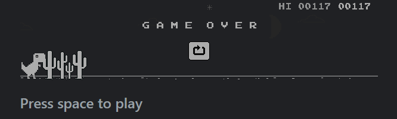
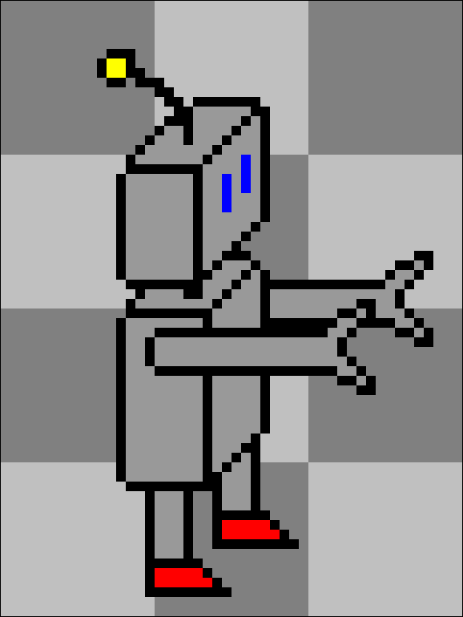
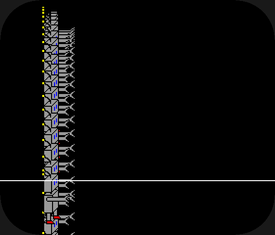

# How to make a Swadge mode

So, you've decided you want to make a swadge mode. Maybe you went to the swadge developer panel, maybe you talked to a dev, or maybe you just picked one up and wanted to know how you actually make a game for a bespoke game console.

Well, you're in the right place.

This document aims to be a full tutorial describing how to make a mode for a swadge. It will walk you through the basics, explain why you would want to pick certain options, and describes the basic loop so you can started pretty quickly.

The Swadge firmware is written in C, so knowledge of C and C-likes will be useful.

If you're ever lost, feel free to message us on slack or discord. We'd love to help you make new games!

## Prerequisites

- Some coding knowledge - This document will not teach you C. It will teach you *why* certain things are done though, and if your familiar with another language you should be able to follow along.
  - Bare minimum knowledge is what types are (bool, int, etc.) and 
  - If you want to learn how to program, [follow this link](https://www.geeksforgeeks.org/how-to-start-coding/). Coding isn't easy, but it's not very hard once you wrap your head around a few key concepts. 
- A dev environment - There's a great tutorial to set it up for Windows, Linux or MacOS [here](./SETUP.md)
- A swadge - Not strictly necessary, but sometimes things that work on the emulator don't work on the real hardware. It's best to be able to test on real hardware at the end of the day.
- A USB-C cable with data - Some cheap USB-C cables are power only. If there's no data lines, you'll have to find a different cord.
- An image editor - Presumably, you're going to want some images. MS Paint will work, but I recommend [Aseprite](https://www.aseprite.org/). You can pick up a custom palette of colors so you use the Swadge colors specifically

## Getting started

While it might be tempting to dive in and start typing, there's a step that is usually helpful in making sure you can actually finish a project.

Documentation!

I know, that stuff seems boring. But when you're writing the documentation there's a bunch of great benefits:
- Fleshing out the project: If you have a seed of an idea, Great! Maybe you want to make a block pusher, or flappy bird, or a Sonic 2 and Knuckles clone. But, what does that entail? If you're making flappy bird, you need a lot less resources than if you want to remakes even a single level of Sonic. You also need to consider each mechanic. Does your game need physics? Motion controls? Precisely timed inputs? If you write it out, you have a chance to think these things through before starting.
- Scope: Once you have the documentation, you know what you're making. It helps to know you don't need to make a food/stamina system for your block puzzler, so maybe don't add that. It also keeps the scope from becoming unmanageable due to scope creep, where the size of the project becomes impossible to comprehend. For larger projects, it also helps compartmentalize each task into an easier part to code.
- Remembering the project later: Sometimes, life gets in the way. If you spend a month away, having a document that tells you what you are expecting to accomplish can help.
- Collaboration: I don't know what you're making until you tell me. And, if you need art or music and want to lean on some of the helpful MAGFest folks, they're going to need to know what you're making and how they can help. If you write it all down and give it to them, they have a better chance of helping you.
- Verification: Okay, the project's done. Does it do what you wanted it to? Do the pets in your pet simulator act properly? Did you cut an entire feature for later and forget about it? Having documentation allows you to look back and check that you're happy with where you got.

If you really don't want to write documentation, you don't have to. A lot of Devs just wing it very successfully. There's a lot of truth to the "Test Early" methodology, which encourages devs to at least make a basic prototype without the bells and whistles to make sure the game is fun before writing a book's worth of documentation. It works different for different people, but if you're using this guide it's likely your first game so maybe at least jot down a few goals or concept art. It can't hurt.

Another consideration is that your grand RPG idea sucks as a first game. It's probably a really cool game, don't get me wrong, but if you spend lots of hours of coding and can't actually run or test anything because the scope is too big, it's easy to lose interest. Consider some of these games as simple starting points:
- Flappy bird
- Tic-Tac-Toe
- Chrome's Dino Jumper
- Snake
- Minesweeper
These projects don't have too much to them, but are all fun to play, right? If you start with one of these, you can get some experience with the swadge so you're not trying to figure out the swadge and an entirely new set of mechanics at the same time.

I'll be building a mode to help illustrate how everything is made, and I will in fact be remaking Chrome's dino runner!

Since I don't just want to use the Dino, I'm going to change the character to robot, and have him jumping flaming barrels and dodging swinging lamps.

### Robo Runner 

For those unfamiliar, the "Chrome Dino Game" is an endless runner that is built into Chrome browser. If you don't have internet, it automatically loads. If you don't want to turn off your internet, you can navigate to chrome::/dino instead. Go ahead and play a few rounds, just remember to come back.

Below, there are two images of the game:




The Dino automatically runs to the side once the spacebar is pressed, and obstacles start appearing from the right of the screen. The player must press the spacebar to jump over the cacti obstacles which vary in size and avoid jumping into the pterodactyls that swoop in. As the Dino runs, it accumulates a score until it collides with an object, at which point the high score is saved and the player is prompted to try again.

And, well, that's going to be my game description. It's not long, but let's break it down, shall we?

Here's some components we're going to need to make this game
- Images
  - The Robo has four images - One with either leg up, one standing still and a surprised one for when it's collided with an object
  - We'll need obstacles, like the cacti and the pterodactyl for the Dino.
  - The ground and background images need to be created
- Sounds
  - There's no background music provided, but there are sounds for when you jump. Having a little beep helps the feel of the game
- Code systems
  - Title/splash screen - It's rude to dump a player into game without warning
  - The ability to show images to the screen
  - The ability to play sounds
  - A font to write the score
  - A way to track the score
  - A way to register input for a jump
  - A way to track collisions
  - A way to spawn obstacles, and get rid of them when we're done. We also want these to not spawn too often
  - A lose screen
  - A way to move the ground and background to give the illusion of movement, speeding up as time goes on.
  - A way to save the final score, even between swadge power-offs

Even a simple game has a lot of systems that it requires to work. Some of the above are trivial to implement, as the relevant systems are already pretty much solved. Others are going to be developed entirely from scratch.

Also, did you notice the new requirement I made while writing it all out? I didn't initially indicate that the ground got faster as time went on. If I hadn't written that out, I might have forgotten to add it in. Or, we could consider it extra since it wasn't part of my initial description, so maybe it's more than I want. For now, let's keep it.

### Next steps

If you haven't already, set up your development environment, and we can move onto the next step. [Click here](./SETUP.md) to load the 'Configuring a development environment' page.

I encourage you to make this game along with me, so I will tell you what you'd need to do to follow along and describing what I'm doing.

## The Dev environment

If this is your first time using VS Code, you might be a little lost. There's a lot of cool features, but you don't need to know too much to be able to program successfully.

If you've used VS Code before, you can skip this section.

### Loading the swadge repository

If you've followed the configuration tutorial, you'll have the files you need on your computer. 

Click "File" in the top bar of VS Code, press "open folder" and navigate to the folder. By default it's under your username/esp/Super-2024-Swadge-FW/

If you've found the correct folder, the files should be shown in the side pane.

### Files


This button will show the file system of the project. Here you can see the status of the files, open or create new files, and navigate around the project.

### Extensions


Extensions provide extra functionality to VS Code. Some common ones are provide the code needed to compile the C code we're writing, spell checkers, syntax highlighters (how we get that colorful text automatically), and even tracking what we still need to get done!

Some of the extensions provided are critical to have installed, such as the C syntax highlighter. Others, such as the spellchecker, are just nice to have. if you're unsure, download all of the ones in the "recommended" tab inside the extensions bar and you'll be fine.

The recommended extensions are per-project, so if you haven't loaded the correct repository they won't show up.

### Debugging


This button leads to the debug screen. When you run your code, sometimes you'll want to stop the program mid-execution to see exactly what it's doing. When you press F5, this tab automatically opens.

### Terminal


The terminal is where you're going to interact with some of the core functions of the library. Don't worry, it's just typing. The terminal will also show you what errors you have, and can be used to provide information on how your mode is operation if you need.

Whenever there's some text that looks like the following: `make all` you can enter it into the terminal to run the command.

There's some features of the terminal that can be done with a graphic user interface (GUI) and I'll point those out when you can make a choice.

If you're in the project directory, why not try running `make all`? See what comes out.

### Useful tips

- You can drag the file tabs around to view more than one at once. You can even open the same tab multiple times 

### Useful Keybinds

- F5: Automatically saves, compiles and runs the set task, which for the swadge is to run the emulator.
- Ctrl+Shift+F5: If you've changed the code with the emulator running, you can use this key combo to restart it with the new code changes.
- Ctrl+B: Closes the side pane for more room
- Alt+Shift+A: Comment/uncomment all selected code
- Ctrl+S: Save the file. This should become a habit.

## Using Git

Alright, you can see the files. Can you start coding now?

Almost! First we need to learn a little bit about git. Git is a versioning software that allows multiple people to work on the same codebase without causing problems. Each individual branch can have any number of changes from the main.

Right now, we need to set up a git branch. Since this codebase is worked on by a lot of people at once, everyone creates their own branch to keep their code separate from everyone else's while it's being worked on. You start on the `main` branch, which is where the core codebase is. All projects should be created off of the main files, since that's the core everyone should be using. 

Everyone can use each branch, so you can theoretically load up someone else's branch and start working in it, but that's inadvisable if you don't know what they're doing! Similarly, others can go into your branch and look at/modify your code. It's rude to do it without permission, but it can happen. When you `git pull` from github, you'll download all changes that have been uploaded.

Your branch will contain all of your code until you eventually have it pulled into the main branch when it's done. This step is the final step, so we're not there yet.

For me, I'm going to create a 'RoboRunner' branch with `git branch RoboRunner` and then `git checkout RoboRunner` to switch to that branch. `checkout` only works when there's no changed files, so if there's anything changed I'd need to stash it away with `git stash`.

Once inside the branch, I can now make my edits without worrying about wrecking other people's code or having ours screwed up by accident!

We'll go over more commands as they become relevant, but below is an overview of a bunch of the relevant commands.

### Useful git commands

- `git status`: Shows the current status (changed files, files to be added next commit, deleted files etc.)
- `git pull`: Pulls the latest code from github. This command is good to run whenever the `main` branch updates so you can see the latest changes. Just make sure all of your changes are committed!
- `git branch <branchName>`: Creates a new branch. If you don't provide a name, it shows the list of already made branches.
- `git checkout <branchName>`: Switches to the specified branch. If you don't provide a branch name, it will tell you which branch you're on.
- `git add <file>`: Adds the selected file to the list of files to commit
- `git commit`: Saves the current state of the files. A hash is generated so you can go back to this state if you need to.
- `git merge <branchName>`: If you want to merge two branches together. Be careful, only merge other branches into yours.
- `git stash` and `git stash pop`: Stores any changes you've made. You can retrieve them by adding pop to the end as shown. Keep in mind, you may want to clear the stash with `git stash clear` occasionally, but make sure there's nothing you want inside of it first!
- `git push`: Once you have a commit, you can push the commit to the github repository if oyu have permission. You'll have to get this from the repository owner.
- `git submodule update`: The swadge repo uses some other repositories, so it's a good idea to run this command to keep them up to date on occasion. If you get errors related to CNFS it could be the submodules are out of date

### Git GUI


If you'd rather use the GUI, you can press the above button in the VS Code editor and all the same functions and more are provided. You'll have to do a little exploring, but there's a lot of cool data in there! It's also helpful when resolving merge conflicts.

## Can we code now? -  The bare minimum to compile

It's time to start writing code. Finally.

If you've been following along and run `make all` earlier you've probably already watched the program compile once. If you tried pressing F5, you probably even got the emulator up on screen. Since we've got our branch too, we can start making new files!

First, decide what kind of mode you want to make. I'm making a game so I make a new folder in `main/modes/games/` called `roboRunner`. inside this folder, I make two new files, `roboRunner.h` and `roboRunner.c`.

These two files will be where my game sits. Let's start with the .h file.

### The header file - roboRunner.h

The header file, denoted by the file extension ".h", provides the overview of the program. When looking into a new program, it helps to look at the header file first to see what the dev wants you to know about the file.

Very few files are going to be looking at this game, since it's not a library. Mostly just the main menu so that players can select this game.

```C
#pragma once
#include "swadge2024.h"

extern swadgeMode_t roboRunnerMode;
```

Very simple! 

#### \#Pragma once

`#pragma once` Tells the compiler to only make this file once. Sometimes files are used by lots of others, and if it's already been compiled, there's no reason to compile it again. All .h files should have this.

Note that some .h files have a `#ifndef _ROBORUNNER_H_` instead of `#pragma once`. It's not exactly the same, but it does the same job. We'll use pragma since it looks nicer.

#### \#include

Moving on, the `#include` finds the appropriate file and loads the data and functions from it. `swadge2024.h` provides the core swadge functionality, so that's really important to have included in the program.

#### extern swadgeMode_t mode;

Lastly, we have `extern swadgeMode_t roboRunnerMode;`. This line lets other programs that `#include` this file access the mode you're about to make. Later, we'll add this to the main menu so you can enter the mode. Obviously, the `roboRunnerMode` is a name we want other parts of the program to use to refer to our mode and should be unique. `extern` just means we're going to be providing the details in the .c file later.

Save this file, and let's move onto the .c file!

### The C file - roboRunner.c

The C file, denoted by the .c file extension, is the implementation of the mode. This is where we're going to be doing the majority of our code. As such, we're going to go more line by line, and then we'll look at the full file at the end.

#### Includes

First of all, we need to include our header file. Easy, it's just `#include roboRunner.h`. We don't need pragma, since the header file handles it.

#### Mode name

Next, we're going to make the string that is used to display the game's name in the menu. 

`const char runnerModeName[] = "Robo Runner";`

Let's break it down real quick:
- const: This can't be changed
- char: This is a character, not an integer or something else
- runnerModeName: This is how we'll find this string later in the codebase.
- []: Denotes an array. In this case, each letter takes one character so we need an array to hold all of them
- "Robo Runner": The text we actually want. Use double quotes around it.
- ; - Denotes the end of a statement. We usually only put one per line.

Setting this to const saves this into the program memory, which is a lot larger than RAM. We'll get into memory management very briefly later. For now, know that it's usually better to put text strings in this format than to leave them directly in the code.

#### Function declarations

Now we need to add the three main function declarations. Functions and function declarations are different; The declaration provides the pattern and the function provides the implementation.

If we had functions other parts of the program would be using, the declarations would go in the .h file, since users of the file would need to see them. Functions internal to the .c file can be declared in the same file as the declaration.

Here's the three functions we're going to declare:
- `static void runnerEnterMode(void);`: This function is called when the mode is entered.
- `static void runnerExitMode(void);`: THis is called when the mode is exited, used to clean up the mode.
- `static void runnerMainLoop(int64_t elapsedUs);`: This is the code that gets called in a loop. All of the actual gameplay code needs to be in here.

Some notes:
- `static` means that this item is only available inside this file. This is good practice, we don't want other people to accidentally use your variables or functions.
- `void`: This is the value the function returns. In this case, it's nothing, or void, for all three.
- `runnerEnterMode()`: This is a function name and declaration. When we want to use this function later, this is what we need to type.
- `int64_t elapsedUS`: This is an argument. If a function doesn't need arguments, you can put void in as well. The specific argument being passed is the number of microseconds since the last time the loop functions was called. It's very useful, and you're required to have it.

Something to note: These aren't strictly necessary. C is read from the top of the file down by the compiler, and as long as it finds each function before it's used, there won't be issues. However, forward declaring them means the compiler knows that the functions are around *somewhere* so it don't throw an error when it doesn't recognize it. Think of it like telling someone not to worry, everyone is fine before describing a car accident.

#### SwadgeMode_t

Remember we made that `extern swadgeMode_t` in the .h file? Time to actually define it. We promised the compiler we would.

The `swadgeMode_t` struct allows us to define the behavior of the mode. This is where we set what peripherals we want to use and tell the rest of the program to use our enter, exit and loop functions. 

We'll look at the structure and what each option means.

```C
swadgeMode_t roboRunnerMode = {
    .modeName                 = runnerModeName,  // Assign the name we created here
    .wifiMode                 = NO_WIFI,         // If we want WiFi 
    .overrideUsb              = false,           // Overrides the default USB behavior.
    .usesAccelerometer        = false,           // If we're using motion controls
    .usesThermometer          = false,           // If we're using the internal thermometer
    .overrideSelectBtn        = false,           // The select/Menu button has a default behavior. If you want to override it, you can set this to true but you'll need to re-implement the behavior.
    .fnEnterMode              = runnerEnterMode, // The enter mode function
    .fnExitMode               = runnerExitMode,  // The exit mode function
    .fnMainLoop               = runnerMainLoop,  // The loop function
    .fnAudioCallback          = NULL,            // If the mode uses the microphone
    .fnBackgroundDrawCallback = NULL,            // Draws a section of the display
    .fnEspNowRecvCb           = NULL,            // If using Wifi, add the receive function here
    .fnEspNowSendCb           = NULL,            // If using Wifi, add the send function here
    .fnAdvancedUSB            = NULL,            // If using advanced USB things.
};
```

Our game is simple; we're using very few of the functions. That's fine though, just knowing that the options are there is good. If we decide to make the robot overheat so you need to throw the swadge into the fridge, we can always set the thermometer to true in the future when we need it.

#### Functions

So, we've finished telling the swadge what it needs to know to use our mode. We've got one final step until we're done with the .c file. We need to add the functions.

```C
static void runnerEnterMode()
{
}

static void runnerExitMode()
{
}

static void runnerMainLoop(int64_t elapsedUs)
{
}
```

Seems pretty similar to the declarations, right? Instead of the semicolon we have curly braces, and we don't need to include the `void` inside the parens. 

The names need to be identical, and the `elapsedUs` needs to be the same, or else the compiler won't realize that these are the same functions and bind them.

If we decided not to forward declare these, then the `swadgeMode_t` struct wouldn't know what a `runnerEnterMode` was and would throw an error.

#### The full .c file

```C
#include "roboRunner.h"

const char runnerModeName[] = "Robo Runner";

static void runnerEnterMode(void);
static void runnerExitMode(void);
static void runnerMainLoop(int64_t elapsedUs);

swadgeMode_t roboRunnerMode = {
    .modeName                 = runnerModeName,
    .wifiMode                 = NO_WIFI,
    .overrideUsb              = false,
    .usesAccelerometer        = false,
    .usesThermometer          = false,
    .overrideSelectBtn        = false,
    .fnEnterMode              = runnerEnterMode,
    .fnExitMode               = runnerExitMode,
    .fnMainLoop               = runnerMainLoop,
    .fnAudioCallback          = NULL,
    .fnBackgroundDrawCallback = NULL,
    .fnEspNowRecvCb           = NULL,
    .fnEspNowSendCb           = NULL,
    .fnAdvancedUSB            = NULL,
};

static void runnerEnterMode()
{
}

static void runnerExitMode()
{
}

static void runnerMainLoop(int64_t elapsedUs)
{
}
```

Now that this is done, we can move onto getting this compiled!

### Compiling

Now that we've got our code, let's make sure it runs!

First, let's hit F5. If the emulator pops up, great! No errors are preventing it from compiling. If you are encountering errors, see "Include Errors" and "Debugging" below.

Assuming it works, you can look around a bunch. Of course, you might be surprised to find your mode isn't in the menu. We still haven't properly added that, so let's do that now.

#### Include errors

Sometimes there's an error where VS Code doesn't recognize all of the `#includes`, known as an include error. If this happens, try restarting your VS Code after saving all the files. Don't worry, VS Code will load the repo and all your tabs right back open. This doesn't stop it from compiling, but the red may hide more serious errors, so it's best to get rid of them.

if this doesn't help, another potential solution appears to be compiling with the idf, so follow the instructions for building the program for the swadge (idf.py) below and it should get fixed.

#### Debugging

So, something is broken. You can tell because when you try to run the emulator it flashes before disappearing, or it just never compiles.

Fear not, the computer is trying to help you figure this out, believe it or not. 

First, check the problems tab above the terminal. It should have a list of compile time errors, or errors that the compiler can catch before you even build the program. Make sure you solve all of these before trying to compile. 

Once those are gone, if you compile and still get an error, you should be able to see some error messages in the terminal.

Pay attention to what the computer tells you in error messages. It will usually provide you a file, a line in that file, what it was trying to do and what the specific error was.

If all else fails, try searching the error message on the internet, or contact the rest of the swadge team on discord or slack.

#### Adding the mode to the menu

Now, we're going to have to modify a few other files. Fortunately, only two more for now.

First up, we need to tell the other modes about our mode. Open `main/modeIncludeList.h` and add our header file to the list of includes. 


Next, open `main/modeIncludeList.c` and add the following:
- Inside the `allSwadgeModes[]` list, add `&roboRunnerMode,` at the end of the list before the end curly brace.
- Add `addSingleItemToMenu(menu, roboRunnerMode.modeName);` inside one of the submenus. Whichever submenu you put this in is where it'll be in the main menu. It's best to put games in the games folder, obviously.


Now, we can recompile and load the emulator with F5 and we'll be able to navigate to the mode and load into it!


Congrats! The mode is running. It's just not doing anything, since we didn't actually provide any code for it to execute. We didn't even give it any way to handle input, so we can't even get out of it, we just need to close it down. But, it works!

#### idf.py

Now that the emulator works, let's make sure we can compile it to load onto a physical swadge.

We can use the following commands to build the program for the swadge.

- Windows: `.\..\esp-idf\export.ps1`
- Linux/MacOS: `source ./../esp-idf.sh`

After that command completes, run `idf.py build`.

It should fail. Why? The idf doesn't know about these new files we made. See, there's two build systems included in this project, one for the emulator and one for the swadge hardware. The emulator uses `make` and the swadge uses `CMake` via `idf.py`. `Make` is able to find the files as long as they're inside the project, but we need to tell `CMake` where the files are.

Inside `main/CMakeLists.txt` you'll see two big lists: SRCS and INCLUDE_DIRS. In SRCS, add any .c files you have. In INCLUDE_DIRS, include all directories you've made. This tells CMake to look inside this folder for files and sub folders, so if you forget to add them you're not going to be able to build the program.


Save the file, and let's try again. You should see a prompt telling you how to flash a swadge now.

Congrats! you now have a working mode.

### Initial commit and pushing

Now that we have something working, lets save it so if we break it in the future we can come back here and not have to rebuild everything.

It's good practice to commit your code after a feature goes in. We're going to be making a bunch of features in this mode, so we're going to commit each one so we can revert or check that the functionality isn't changing. If you get into the habit of only working on one part of the system and committing each time, it'll make returning to find and fix bugs a lot easier later.

However, you should bundle like items into a commit. While I could make a commit for each file, that's a lot of work and until all of them are done the program isn't going to work anyway.

First, I'll run `git status` to see what's currently going on.

```
On branch RoboRunner
Changes not staged for commit:
  (use "git add <file>..." to update what will be committed)
  (use "git restore <file>..." to discard changes in working directory)
        modified:   main/CMakeLists.txt
        modified:   main/modeIncludeList.c
        modified:   main/modeIncludeList.h

Untracked files:
  (use "git add <file>..." to include in what will be committed)
        main/modes/games/RoboRunner

no changes added to commit (use "git add" and/or "git commit -a")
```

Alright, so we've got three modified files. These are the ones we changed to add our mode to the menu and get `idf.py build` to compile. The other files are untracked, since they're brand new. We need to add all of these to the commit.

``` bash
git add main/CMakeLists.txt
git add main/modeIncludeList.c
git add main/modeIncludeList.h
git add main/modes/games/RoboRunner/*
```

If you add "*" you will include all the files inside that folder. If the status command only lists files you want in the commit, you can just run `git add *` and it'll grab all files. Just be careful you didn't accidentally change other files first.

Now you can run `git status` again and verify all the files you want are added, and the ones you don't want aren't included. You can start over with `git reset` if you accidentally added the wrong files.

Once you're satisfied with the file list, run the following command: `git commit -m "Initial Commit"` This will add the message to the commit so you don't have to memorize a hash to come back. THe message should be as descriptive as required, such as "misc bug fixes" or "Added blowing on microphone to jump". If you're writing paragraphs, you probably need to commit more.

The last step can only be done if we have write access to the github repository. If you have access, you can push to the external repo, saving your code outside you computer so other devs can work on it and if your computer dies you'll be able to pull the files back down.

Run `git push --set-upstream origin RoboRunner` to create the branch on the github server and send the files to it. You will have to log in.

If successful, your code is now saved to the cloud and can be pulled to a different computer! 

We've done a lot of work and all we've got to show for it is a blank black screen, so in the next section let's give ourselves something to look at, hmm?

## Loading resources

In this section, we're going to draw something to the screen. 

First, we need to make an image to display. I'm going to make the little robot that's gonna do the running. I prefer to use Aseprite to make images, and here's the result!



Did I mention I don't do art? I don't do art. Still, it's better to have this guy than nothing. 

If you're following along feel free to use any other small PNGs or make your own. They don't need to be perfect, just something to see what's going on. Don't worry about quality, making programmer art is a time honored tradition among game developers. Remember, if you make something fun and want better art, we have artists who love to help work on the games we make. You can ask for their help, or help from other people in your circle who like to make art. Swadge games are collaborative, so don't be shy!

Some notes:
- The swadge color palette can be found [here](./SwadgePalette.gpl). The swadge will crunch down other colors to closest match, but for better control, you can use this subset of colors to ensure it looks the same as originally designed if using Aseprite
- The Swadge's screen was 280 wide x 240 tall for at least '23 through '25. This isn't that large, so a super detailed 1000 pixel square character isn't going to fit.
- The Swadge's screen is pretty small in reality. The emulator's screen will make them a lot larger which is good for debugging but can fool your brain into thinking that's the end size.
- images that are too large will not load. It has to do with memory size, not just pixel size, so there's no specific limit. Just keep the files a reasonable size and it'll be alright.

All art and sounds go into the `assets/` folder in the repository. Make a new folder and copy all the assets into it. During compilation, they will be converted automatically to a format the swadge can use.

### Memory 

Now that I have some basic art, we can see about getting it into the Swadge. The Swadge has limited RAM, so each mode has to allocate and de-allocate RAM whenever the mode is entered or exited. We can't afford to have everything loaded all the time. If you recall use making the mode name up above, this is the reason we made it `const` so the bytes aren't taking up space in RAM.

The easiest way to make sure the RAM is properly managed is to put all the variables into a "mode struct", or a simple data structure that will contain all the data as we can load and de-load it easily.

```C
typedef struct 
{
    wsg_t character;
} runnerData_t;
```

The above code creates a struct called runnerData_t with one member, that of a wsg_t called character. Anytime we use typedef, we are defining a new type, so we add "_t" to the end so we know what it is later. You'll note that the member, "wsg_t", is also a type.

Of course, we don't know what that is, so let's look that up, shall we? One of the most important skills in game development is being able to read the technical documentation. Right now, we have no idea what this wsg thing is but it's certainly valid code.

If you navigate to [The documentation](https://adam.feinste.in/Super-2024-Swadge-FW/index.html) you'll find a lot of useful information. It's all generated directly from the code, so we can be sure it's up to date with the `main` branch. Here, we can go find the wsg.h file and figure out what it's used for.

Turns out, it's our image handler. Pretty easy to get from context, but anytime there's something you want to know about, look it up in the documentation. In fact, maybe set aside some time to look through random bits of the library. See how other modes were built, look at the functions. This will help you figure out what the other devs have worked and how everything is organized. It's a good idea to bookmark it for easy browsing later.

Well, now that we have our struct, we need allocate space and keep a reference to the memory space. We can accomplish this by first creating a pointer right after the swadgeMode_t struct:

```C
runnerData_t* rd;
```

And then by changing the enter mode function to the following:

```C
static void runnerEnterMode()
{
    rd = (runnerData_t*)heap_caps_calloc(1, sizeof(runnerData_t), MALLOC_CAP_8BIT);
}
```

That's a lot, but here's the breakdown:
- heap_caps_calloc() allocates memory. This tells the swadge or emulator to make space for the data we're going to save.
- The arguments:
  - 1: The number blocks of memory to initialize. We only need one copy of runnerData_t, so 1.
  - sizeof(runnerData_t): This automatically gets the size of runnerData_t. If we add thirty more "wsg_t"s, this will automatically ensure the memory picked up is the right size.
  - MALLOC_CAP_8BIT: This is a mode thing. Unless it breaks, just use this.
- (runnerData_t*): The memory that heap_caps_calloc() assigned to us isn't typed, it's just a bunch of holes to fill numbers into. This snippit of code tells the compiler that memory we just allocated fits into rd
- rd: A pointer to the memory we've just allocated.

So, pointers. It's not complicated, but when you're unfamiliar it does seem overwhelming. A pointer is an address to a value. Think of it like a mailbox. The mailbox contains the value, whether it's a single true/false or an entire swadgeMode_t struct. The pointer is the number on the side of the mailbox. Sometimes it's a lot easier to say "grab whatever's in mailbox 20" instead of describing each part of the data inside the mailbox.

In our case we're doing this because we don't actually know which mailbox out runnerData_t is assigned to. What we do know is that whatever that mailbox ends up being we've stored the number inside `rd`. 

So, `rd` contains an address. We don't really care where, just that it exists. Great.

There's one more thing we need to do to avoid breaking the program. Right now, we've allocated the data, but we haven't freed the space for other programs to use once we're done.

We can accomplish this by changing the exit mode function like so:
```C
static void runnerExitMode()
{
    heap_caps_free(rd);
}
```

This will de-allocate the memory.

### Images, finally

Now we're going to allocate memory for the WSG. All assets (images, fonts and sounds) need to be allocated and de-allocated just like individual blobs of memory.

Remember, the order of allocating memory matters! If item X contains item Y, and we free item X before Y, the program doesn't know how to access Y anymore and we cause memory leaks. Also, we can't allocate for Y if X isn't already allocated.

The two new functions we need are easy to find in the documentation, so if you checked it out you've probably already seen them.

```C
loadWsg(image, &storedImage, true);
freeWsg(&storedImage);
```

`storedImage` is where we are storing an image to. We need to store it so it doesn't get deleted before we use it.

The ampersand "&" symbol means "grab the data inside the mailbox, not the number on the side of the mailbox". Conversely, an asterisk "*" indicated that you want the number of the mailbox instead of the data you're looking at, a pointer.

The `image` is the name of the image to load. Any .png file in the assets folder will automatically be converted. `roboStanding.png` will be converted to `ROBO_STANDING_WSG` next time the code is compiled. If it's already been compiled once, the program will autocomplete the word for you.

Lastly, that last `true` at the end of the load function tells the swadge which RAM to put the image into. When in doubt, leave it on true, as this will load it into SPI RAM. SPI RAM is slower, but a lot more plentiful.

We want to store the image into rd, which means we can replace `storedImage` with `rd->character` and `image` with `ROBO_STANDING_WSG` and then put them in our existing functions. The arrow notation between rd and character indicated that rd points to the character data.

Given we know that rd needs to be allocated, we need to put the `loadWsg()` function after the `heap_caps_calloc()` and the `freeWsg()` before the `heap_caps_free(rd)` functions. 

```C
static void runnerEnterMode()
{
    rd = (runnerData_t*)heap_caps_calloc(1, sizeof(runnerData_t), MALLOC_CAP_8BIT);
    loadWsg(ROBO_STANDING_WSG, &rd->character, true);
}

static void runnerExitMode()
{
    freeWsg(&rd->character);
    heap_caps_free(rd);
}
```

Now, the wsg is loaded and we can actually start to use it!

In the main loop function, add `drawWsgSimple(&rd->character, 32, 184);`

We pass in three arguments:
- &rd->character: The address of the wsg inside rd->character
- x Offset: How many pixels across the screen from left to right the image is drawn at
- y Offset: How many pixels from top to bottom the image is offset by

The Swadge draws images assuming the top left corner is the start. For our example, the top left corner will be located at 32 pixels across, 32 pixels down resulting in the following once we press F5 and load up the new mode:


Some things you'll note if you start to play with the numbers is that the corners of the screen are obscured. This is because the real screen we're using has rounded corners. The shrouded portions are roughly equivalent to the real screen. Another thing to note is that the last time the pixel is updated is what's going to be drawn. So if you want to draw text over a textbox, the box needs to be drawn first or the box will overwrite the text.

Next, we'll add some ground to stand on.

Before the function drawing the sprite, add the following line: `drawLine(0, 184, TFT_WIDTH, 184, c555, 0);`
- `drawline()`: Draws a line as defines by the first four numbers
- `TFT_WIDTH`: This is a Macro. Macros will be explained later, but this one is just eh value 280, which is the width of the swadge screen in pixels.
- `c555`: The swadge color palette uses this notation. c555 is white, c000 is black.
- The last zero is dash width. We don't want our ground line to be dashed, so zero.

If you look into the documentation for drawLine() (shapes.h) you can see that if you specify the start x and y and the end x and y you can draw the line. We set both Y values to 184 since that seems about right, but the X values are on opposite sides of the screen (0 and 280). This draws a white line directly across the screen.

Play with the colors (try c500, c050, c005, and c123) and the x and y positions on either end and watch how the line moves. Make sure to save the file before reloading the emulator!

If you place the draw line function after the `drawWsg()` you'll notice the line draws on top of the robot, which definitely looks wrong. Remember, draw order matters. 

Right now, we're drawing the robot standing in the same place every frame, which is boring. Let's get some actual movement on screen!

### Final code for this section

```C
#include "roboRunner.h"

const char runnerModeName[] = "Robo Runner";

typedef struct 
{
    wsg_t character;
} runnerData_t;

static void runnerEnterMode(void);
static void runnerExitMode(void);
static void runnerMainLoop(int64_t elapsedUs);

swadgeMode_t roboRunnerMode = {
    .modeName                 = runnerModeName,
    .wifiMode                 = NO_WIFI,
    .overrideUsb              = false,
    .usesAccelerometer        = false,
    .usesThermometer          = false,
    .overrideSelectBtn        = false,
    .fnEnterMode              = runnerEnterMode,
    .fnExitMode               = runnerExitMode,
    .fnMainLoop               = runnerMainLoop,
    .fnAudioCallback          = NULL,
    .fnBackgroundDrawCallback = NULL,
    .fnEspNowRecvCb           = NULL,
    .fnEspNowSendCb           = NULL,
    .fnAdvancedUSB            = NULL,
};

runnerData_t* rd;

static void runnerEnterMode()
{
    rd = (runnerData_t*)heap_caps_calloc(1, sizeof(runnerData_t), MALLOC_CAP_8BIT);
    loadWsg(ROBO_STANDING_WSG, &rd->character, true);
}

static void runnerExitMode()
{
    freeWsg(&rd->character);
    heap_caps_free(rd);
}

static void runnerMainLoop(int64_t elapsedUs)
{
    drawLine(0, 184, TFT_WIDTH, 184, c555, 0);
    drawWsgSimple(&rd->character, 32, 184);
}
```

## Input

Let's get the jumping ability coded. Since the obstacles come to us, we just need to jump up and then fall down. The robot can only jump when on the ground. We'll allow the player to press either the A button or the up button to jump, and we want the robot to have a graceful arc. 

An improvement to game feel might be to vary the height of the jump based on the length of the button press, but that's more than we described above. Maybe we'll fit it in later.

### Basic input

We're going to start to accept inputs now. Update the main loop to look like the following:

```C
static void runnerMainLoop(int64_t elapsedUs)
{
    buttonEvt_t evt;
    while (checkButtonQueueWrapper(&evt))
    {
        if (evt.down)
        {
            if (evt.button & PB_A || evt.button == PB_UP)
            {
                // We'll add code here in the next part
            }
        }
    }
    drawWsgSimple(&rd->character, 32, 32);
}
```

Here's a breakdown of the parts of the input:
- `buttonEvt_t evt;`: Creates a event struct. this contains a single button state at a time
- `checkButtonQueueWrapper()`: The swadge has an internal buffer for buttons. This takes the next button and sets the event (passed as an argument) to the state the button is at.
- `while(){}`: The while loop continues to execute until `checkButtonQueueWrapper()` returns false because there's no more buttons pressed.
- `if(){}`: If the contained statement is true, execute the code inside the curly braces.
- `evt.button & PB_A || evt.button == PB_UP`: This is an expression that evaluates to true or false.
  - `evt.button & PB_A`: If the A button is pressed, value is set to true
  - `evt.button == PB_UP`: If the up button is pressed, value is set to true
  - `||`: Logical OR. Basically, if the left hand side is true OR the right hand side is true, the whole thing is true.
- `rd->jumped`: This is the most important part, this is where we tell the rest of the mode that we just jumped in the air.

You'll note that when checking if the button is A we used a single ampersand and for checking the up button we used "==". Both work, it's a matter of preference. I prefer the ampersand.

### Jumping robots

Now we know if the player has pressed buttons, but we need to define what it means to jump. Obviously, we're going to want to see the robot jump, and that involves moving on the Y-axis (up and down), so we're going to need to track the Y position. We're also going to need to know what speed the robot is going, and whether it's up or down. Lastly, we're going to need to know if the robot is on the floor.

This is three variables: Y position, Y speed and on Ground. Y position is where the robot is in space, the Y speed is how fast he's moving, and on ground tells us if the robot can jump again. After all, he's using his little legs, not a jetpack.

Modify the runnerData_t struct to look like this:
```C
typedef struct
{
    // Assets
    wsg_t character;

    // Robot
    bool onGround;
    int ySpeed;
    int yPos;
} runnerData_t;
```

This will allow us to save this data between frames. You access it the same way you did with the wsg, so I'm not going to point it out anymore. Now we need to decide what to do with these variables.

First of all, change the `128` in `drawWsgSimple()` to `rd->yPos`. We want the image to follow the height we give to it. Right now `rd->yPos` starts at 0, so it'll draw the sprite at the top of the screen.

Next, we want to change the speed. After the input while loop, add the following:

```C
rd->yPos += rd->ySpeed;
rd->ySpeed += 1;
```

The first line adds the current speed to the robot. The second line increases that speed every frame. It's adding 1 because y increases in the downward direction, so this acts like gravity.

`+=` is a shortcut. Expanded out, this looks like `rd->yPos = rd->yPos + rd->ySpeed;`. This is the convention since it matches how CPUs actually handle the data, but it's a lot less text to type out if we use `+=`. There's no difference to the computer at the end of the day, so don't stress out about it.

Lastly, let's add something into the input loop. Add `rd->ySpeed = -12;`. It's negative because we want to go up, and -Y is up. You'll note we don't use `+=` here, and that's because we don't care what the value used to be, we want it to be -12 when we hit the key.

Let's hit F5!



Well, that's not right.

If you restart the program and spam the jump key, you'll see that the robot can actually stay in frame if you jump fast enough. Congratulations, we've just made flappy robot. Seeing as that's not the goal, let's take an inventory of the issues:
- The robot never stops falling
- The robot can jump in the air
- The swadge just draws over the previous frame, resulting in a series of images instead of what you'd expect.

We'll tackle the visuals first.

#### Sidebar - Get rid of overdraw

The Swadge doesn't automatically refresh the screen, as it turns out. Any pixels not updated from the last frame will remain the same. This could be used to optimize things if the mode is very, *very* constrained, but in general we can just redraw everything each frame. 

In our case, we're already drawing everything we want each frame, so all we need to do is clear the screen.

Add a simple `fillDisplayArea(0, 0, TFT_WIDTH, TFT_HEIGHT, c001);` before the line and wsg draw lines. If you want to, you can change the color to see which you like best. This function draws from the top left corner (0, 0) to the bottom right corner, (TFT_WIDTH, TFT_HEIGHT) in the color chosen. Since it'll write over every pixel, the only things we'll see on the next frame are whats drawn that frame.

#### Back to fixing

Really, we should have seen it coming. We didn't use onGround, so obviously it's not going to work!

Change the `(evt.button & PB_A || evt.button & PB_UP)` to `((evt.button & PB_A || evt.button & PB_UP) && rd->onGround)`. The parenthesis are import for grouping here, so make sure you get it right. Whatever is inside the innermost set of parenthesis will evaluate first, and we want that to the button check. If either of the buttons are pressed, we can check if we're on the ground. `&&` is the logical AND operation, so what just told the program is: "If A or up is pressed, and the character is on the ground" you can add the negative speed.

If we run the program now, all we've managed to accomplish is stopping the double jumps. This is because we've never set onGround to true, so we can't ever jump. Instead of doing an actual collision check, let's just use where the robot is on the screen to determine if it should be on the ground or not.

We can add the following check after setting the ySpeed to += 1:
```C
if (rd->yPos > 128)
{
    rd->onGround = true;
}
```
And after we set the ySpeed to -12, we can add a single line: `rd->onGround = false;`

Now the robot will know it's hit the ground if it's low enough on the screen, but we still haven't stopped it entirely. Right now, the speed keeps accumulating and the robot keeps falling.

Inside the new if loop, we can add two more lines to make the robot behave as we want:
```C
rd->yPos     = 128;
rd->ySpeed   = 0;
```
Setting the position to 128 means that it doesn't matter exactly how far the robot fell below the ground, we'll snap it back to the level of the floor (which I have determined through trial and error is 128 pixels down the screen) and set the speed to 0.

Technically, we don't need to set the speed to 0, but if we don't and we wait long enough the integer will overflow to a massive negative number and the robot will go shooting into the sky. We'd have to wait roughly nine minutes at 60FPS, and it would just look like the robot disappears since it'll be moving so fast. It's good practice though, so let's do it.

An interesting experiment is to only set the speed to 0. The robot gets stuck below where we wanted him to on the floor. He overshot on the initial fall from the top of the screen and since we're not resetting him to the ground, he just stays down there. If we set yPos at the start of the program, we could avoid needing this line entirely! I'll leave it though, since it works fine.

Now the robot should jump as expected!

### Macros and Magic Numbers

I promised to tell you about macros, and here's where I'm doing that. 

Macros are a "preprocessor" step, which means the compiler moving things around before actually compiling your code. Sounds scary, and if used incorrectly it causes all sorts of problems. So then, why tempt fate and use them?

Because they can be very useful in getting rid of magic numbers, that's why. Right now, we have plenty of magic numbers, or numbers that we just put in without saying how we got them.
- Jump height: -12
- ySpeed increase each frame: 1
- height on screen before onGround is set to true: 128
- Ground line draw height: 184
- Player distance from the left of the screen: 32

The code works the way we have it, but what if you want to raise the height of the ground line by one pixel? You have to change it in several places. Or, we could forget what -12 means. Or, what if we don't know how wide the screen is?

Remember, we used the TFT_WIDTH and TFT_HEIGHT macros before. We didn't make these, someone else did. Presumably, if the screen size is changed, we can assume that these Macros are being changed appropriately, so we don't suddenly find our code doesn't work because the screen is 32 pixels wider or something. It also helps us as devs since we don't need to remember how wide the screen is, we can just grab the number.

In the same way, we can define our own Macros to provide us with an easy way to tweak the program, and recall what the value is.

At the top of the file, just under the `#import` statement, let's add the following lines:
```C
#define JUMP_HEIGHT          -12
#define Y_ACCEL              1
#define GROUND_HEIGHT        184
#define PLAYER_GROUND_OFFSET (GROUND_HEIGHT - 56)
#define PLAYER_X             32
```
This will allow us to use the tags we've written to replace the magic numbers. Go back through the file and replace the numbers with the Macros.

Note that you shouldn't be replacing every value. 0, for instance, isn't the same value in all instances. Sometimes it's the initial x or y coordinate, sometimes it's the length of the dashed line. If we had two numbers that were both 32, but only one of them relates to the player, we don't want to adjust the player and this other number when we're not expecting to.

In addition, obvious numbers don't need to be included. We don't want dashed lines, but since the function requires it, we're just going to put a 0 in there. We don't care what it is, it works and we're never going to adjust it.

### Completed section code

Now that we've put in the Macros, the code should look similar to this:
```C
#include "roboRunner.h"

#define JUMP_HEIGHT          -12
#define Y_ACCEL              1
#define GROUND_HEIGHT        184
#define PLAYER_GROUND_OFFSET (GROUND_HEIGHT - 56)
#define PLAYER_X             32

const char runnerModeName[] = "Robo Runner";

typedef struct
{
    // Assets
    wsg_t character;

    // Robot
    bool onGround;
    int ySpeed;
    int yPos;
} runnerData_t;

static void runnerEnterMode(void);
static void runnerExitMode(void);
static void runnerMainLoop(int64_t elapsedUs);

swadgeMode_t roboRunnerMode = {
    .modeName                 = runnerModeName,
    .wifiMode                 = NO_WIFI,
    .overrideUsb              = false,
    .usesAccelerometer        = false,
    .usesThermometer          = false,
    .overrideSelectBtn        = false,
    .fnEnterMode              = runnerEnterMode,
    .fnExitMode               = runnerExitMode,
    .fnMainLoop               = runnerMainLoop,
    .fnAudioCallback          = NULL,
    .fnBackgroundDrawCallback = NULL,
    .fnEspNowRecvCb           = NULL,
    .fnEspNowSendCb           = NULL,
    .fnAdvancedUSB            = NULL,
};

runnerData_t* rd;

static void runnerEnterMode()
{
    rd = (runnerData_t*)heap_caps_calloc(1, sizeof(runnerData_t), MALLOC_CAP_8BIT);
    loadWsg(ROBO_STANDING_WSG, &rd->character, true);
}

static void runnerExitMode()
{
    freeWsg(&rd->character);
    heap_caps_free(rd);
}

static void runnerMainLoop(int64_t elapsedUs)
{
    // Check input
    buttonEvt_t evt;
    while (checkButtonQueueWrapper(&evt))
    {
        if (evt.down)
        {
            if ((evt.button & PB_A || evt.button & PB_UP) && rd->onGround)
            {
                rd->ySpeed   = JUMP_HEIGHT;
                rd->onGround = false;
            }
        }
    }

    // Update player position
    rd->yPos += rd->ySpeed;
    rd->ySpeed += Y_ACCEL;
    if (rd->yPos > PLAYER_GROUND_OFFSET)
    {
        rd->onGround = true;
        rd->yPos     = PLAYER_GROUND_OFFSET;
        rd->ySpeed   = 0;
    }

    // Draw screen
    fillDisplayArea(0, 0, TFT_WIDTH, TFT_HEIGHT, c001);
    drawLine(0, GROUND_HEIGHT, TFT_WIDTH, GROUND_HEIGHT, c555, 0);
    drawWsgSimple(&rd->character, PLAYER_X, rd->yPos);
}
```
If you want, try playing with the macro values to find something you like. 

Now that we've started to get a handle on things, this tutorial will move a little faster. 

## Obstacles

Now that we can jump to avoid obstacles, let's add some obstacles to avoid.

We're going to have two obstacles: One for the top of the screen to make sure you're not jumping and one on the bottom to force you to jump.

First, let's make a new struct for the obstacle.

#### The struct and geometry.h

```C
typedef struct
{
    rectangle_t rect; // Contains the x, y, width and height
    int img;          // Image to display
    bool active;      // If the obstacle is in play
} obstacle_t;
```

`rectangle_t` is from the geometry library, which we don't have included yet. It's easy, just add `#include "geometry.h"` near the top of the file. The errors should go away as soon as VS Code catches up. The geometry library has functions for checking collisions, so that's going to be useful going forward. If you want specifics, check out the file.

#### Refactoring

Next, let's refactor the player to allow for collisions. Refactoring is converting code from one format to another, theoretically without changing the functionality. Moving where code is for clarity, removing unnecessary code, stuff like that. The data saved in the runnerData_t struct can all be moved to a player struct. This will keep all the relevant data together. In addition, we're going to use rectangle_t to provide the yPos instead of the current variable, since it's otherwise a duplicate.

The struct section should look a lot like this now.

```C
typedef struct 
{
    rectangle_t rect; // Contains the x, y, width and height
    wsg_t img;        // The image
    bool onGround;    // If the player is touching the ground
    int ySpeed;       // The vertical speed. negative numbers are up.
} player_t;

typedef struct
{
    rectangle_t rect; // Contains the x, y, width and height
    int img;          // Image to display
    bool active;      // If the obstacle is in play
} obstacle_t;

typedef struct
{
    // Robot
    player_t robot;

    // Obstacles
    obstacle_t obstacles[2];
} runnerData_t;
```

In the runnerData_t, we're now storing one copy of the robot and two copies of the obstacle. This is another magic number we can change to a Macro. I'll leave that as an exercise for the reader.

Now that we've refactored, there's a lot of red. Let's start converting them.
- `&rd->character` becomes `&rd->robot.img`
- `rd->onGround` becomes `rd->robot.onGround`
- The most complicated on is yPos, which goes from `rd->yPos` to `rd->robot.rect.pos.y`
The rest should be evident. Once you're done, hit F5 to make sure that the code still runs as expected.

While we're refactoring, let's also break out some of the code into more functions. Keeping the draw calls in the same place will come in handy later, as well as handling the logic updates separately.

Make new function declarations near the top like this:

```C
static void runnerLogic(int64_t elapsedUS);
static void draw(void);
```

We're not using the `elapsedUS` right this moment, but we're probably going to need to soon. Cut the drawing functions and add them to the draw function, then add the draw function to the end of the loop. Do the same with the player logic as well.

```C
static void runnerMainLoop(int64_t elapsedUs)
{
    // Other code...

    // Update player position
    runnerLogic(elapsedUs);

    // Draw screen
    draw();
}

static void runnerLogic(int64_t elapsedUS)
{
    rd->robot.rect.pos.y += rd->robot.ySpeed;
    rd->robot.ySpeed += Y_ACCEL;
    if (rd->robot.rect.pos.y > PLAYER_GROUND_OFFSET)
    {
        rd->robot.onGround   = true;
        rd->robot.rect.pos.y = PLAYER_GROUND_OFFSET;
        rd->robot.ySpeed     = 0;
    }
}

static void draw()
{
    fillDisplayArea(0, 0, TFT_WIDTH, TFT_HEIGHT, c001);
    drawLine(0, GROUND_HEIGHT, TFT_WIDTH, GROUND_HEIGHT, c555, 0);
    drawWsgSimple(&rd->robot.img, PLAYER_X, rd->robot.rect.pos.y);
}
```

We've added a lot of code and nothing has changed behavior-wise. That's what refactoring is like, but now we have our code split a bit more and can follow where everything goes easier.

### Spawning obstacles

Now we can start spawning some obstacles. I've drawn the obstacles with my expert artistic skills.


As before, art is essential to get a general feel for a game so it's not all just code, but it doesn't need to be perfect, especially at this stage. If you want to go overboard with the art, that's fine too. I lean toward the former, obviously.

First, let's load and unload these new files. The following snippits of code are a really useful pattern, since you only have to add the file identifier once and it will be automagically loaded and unloaded.

```C
// Put this below the defines. If you use different filenames, make sure to change them accordingly.
static const cnfsFileIdx_t obstacleImages[] = {
    BARREL_1_WSG,
    LAMP_WSG,
};

// These will be used to select between types later.
typedef enum
{
    BARREL,
    LAMP,
    NUM_OBSTACLE_TYPES // Always last in enum, will equal qty of types above it.
} ObstacleType_t;

// Add this to the Data struct
wsg_t* obstacleImgs;

// Useful for loading a lot of sprites into one place. Put in the enter function
rd->obstacleImgs = heap_caps_calloc(ARRAY_SIZE(obstacleImages), sizeof(wsg_t), MALLOC_CAP_8BIT);
for (int idx = 0; idx < ARRAY_SIZE(obstacleImages); idx++)
{
    loadWsg(obstacleImages[idx], &rd->obstacleImgs[idx], true);
}

// Remember to de-allocate whatever you use inside the exit function!
for (int idx = 0; idx < ARRAY_SIZE(obstacleImages); idx++)
{
    freeWsg(&rd->obstacleImgs[idx]);
}
heap_caps_free(rd->obstacleImgs);
```

Here's a breakdown of the process:
- First, we make a list of the image indexes.
- We create an enum of types for later
- We add a place to put a pointer for reference later into the data struct
- We initialize the memory space with heap_caps_calloc() to the same size as the const array from before to automatically get the correct size
- We loop through each item and assign them in order
- Lastly, we de-allocate each image and then the containing memory in the exit function

#### Loops

An important part of programming is loops. There's three primarily used in C:
- For: Set the number of times the loop executes ahead of time
- While: Loop until a condition is met
- Do while: Execute a loop once, then if a condition isn't met yet, continue doing it.

For loops are extremely common, and they have their own loop counting variables built in. in this case, `idx`. YOu can see that first we set it's initial state to 0, tell it to continue until it matches the array size of `obstacleImages` and finally tell it to increment by one each loop (idx++). Note that if we want to, we can change idx inside the loop, but doing that thoughtlessly could get the computer stuck in the loop. The condition to exit the loop is that `idx` needs to be larger than the array, or 2. If we set `idx` to 0 at the end of each loop, the end of the loop will change the value to 1 and it will get stuck doing this infinitely.

The "++" notation can be used on any variable. It's just faster to write `idx++;` than writing either `idx += 1;` or `idx = idx + 1;` and can sometimes be used in tricky ways to speed up the program, but that's far outside the scope of what someone new to developing needs to worry about. "--" works in the same way to subtract one.

While loops check that a condition is true and loop if it's not. `while(y > 0) {}` will execute everything inside the curly braces until y is less than or equal to 0. It's important to update y inside the loop or the program will get stuck.

Do While loops are just while loops, but will run the content of the curly braces once before checking the condition.
```C
do
{

} while (y > 0);
```
In this case, even if y is already less than 0 it will execute once anyway. 

### Back to obstacles

Next, let's discuss how we want to handle the objects. First, we need to give them an initial spawning position and give it a sprite to draw. Next, we need to get them to move based on how long the game's been running. Third, we need to spawn them randomly.

We're gonna need a bunch of code for this, so let's get to typing.

First, let's make a spawn function.

```C
static void spawnObstacle(ObstacleType_t type, int idx)
{
    // Change this obstacle to active only if not already active, and abort if not.
    if (rd->obstacles[idx].active)
    {
        return;
    }
    // Might want to be more explicit
    rd->obstacles[idx].active = true;

    // Set data that's not going to change
    rd->obstacles[idx].rect.pos.x = TFT_WIDTH - 64; // This magic -64 makes sure the images start on screen to make sure they're loading. We'll remove it later.

    // Set box size
    // Note that both my obstacles are the same size, so changing it at all is redundant
    // Since they only need to be set once, we can even move them to the initialization step
    // If they were different, we could put them below and adjust based on the specific requirements.
    rd->obstacles[idx].rect.height = 24;
    rd->obstacles[idx].rect.width  = 12;

    // Switch based on type
    switch (type)
    {
        case BARREL:
        default:
        {
            // Set Y position
            rd->obstacles[idx].rect.pos.y = BARREL_GROUND_OFFSET;

            // Set sprite
            rd->obstacles[idx].img
                = BARREL; // Only works because the order we loaded the sprites into the initializer list. If barrel was second in the enum or we flipped the order to load the images into the obstacle array this would break
            break;
        }
        case LAMP:
        {
            // Set y position
            rd->obstacles[idx].rect.pos.y = 0; // 0 is the top of the screen

            // Set sprite
            rd->obstacles[idx].img = LAMP;
            break;
        }
    }
}
```

and temporarily, we can thrown the following into the mode entry function to test that they draw:

```C
// Initialize the obstacles so we don't accidentally call unloaded data.
for (int idx = 0; idx < MAX_OBSTACLES; idx++)
{
    rd->obstacles[idx].active = false;
}
// Temp
spawnObstacle(BARREL, 0);
spawnObstacle(LAMP, 1);
```

#### Unset variables

Something to remember about C is that the variables don't have a default state when initialized. `int abc;` could hold literally any value that `int` can hold. Thus, we need to set it first. Things that only need to be set once can be set to const or during the mode entry function, whereas other items may need to be set more often, like our obstacles. Each time a new one is made, it has to be moved to the far side of the screen, set to either a lamp or a barrel, and then assigned the appropriate height and image. All common variables can be set regardless, which makes the code shorter and easier to read.

We have to have to set both obstacles to false before any code could try to call them, find a random `true` in the .active slot and then try to load who knows what data.

#### Fixing up the lamps

Now we check how it looks, and... well, the lamps are really hard to see on the black background, and they're too high. it would be impossible for the robot to hit them evan at max jump height.

Let's change the color of the background to something easier to see the lamps on. Using `c112` instead of `c001` in the `fillDisplayArea()` function will lighten the colors one shade. That will make the lamps easier to see.

Next, let's create a ceiling to lower the lamp without having it suspend in space. Much like we draw the ground, we can draw the ceiling with a single white line. Just copy and paste the ground line and make a `CEILING_HEIGHT` define to a value below the jump height.

Lastly, change the lamp to start at `CEILING_HEIGHT` instead of 0.

This leaves a lot of space over top of the play area, but we can use that fro displaying the high score or current score later.

### Moving the obstacles

We don't want the obstacles to just sit there and taunt us, we need them to charge us. Well, we want it to look more like our robot is charging the obstacles, but functionally we'll just have the obstacles come to us.

As a first, "let's just get it to work" type start, let's subtract one from it's x position every loop of the game. 

```C
for (int idx = 0; idx < MAX_OBSTACLES; idx++)
{
    rd->obstacles[idx].rect.pos.x--;
}
```


That turns out to be too slow. A snails pace. The actual speed will depend on the hardware, which is actually worse but we'll fix that in a bit.

We can speed it up by changing the amount that is subtracted each round. Trying `rd->obstacles[idx].rect.pos.x -= 3;` This feels okay, but reveals a problem. We're locked to integers, which are kind of restrictive.

Instead, we're going to use `elapsedUs`. This value is how much time has passed between the most recent call to the main loop and the previous. This is useful if we want the timing to be consistent despite framerate. For example, `elapsedUs` would be 1,000,000 if the swadge is operating at 1 update a second, and roughly 16,377 if it's operating at 60 updates a second. Since each update is basically a frame, this equates with frames per second. Each frame has a length of time it took to execute, and it can change frame to frame. We want to minimize the impacts this has.

Let's make this a new function, `static void updateObstacle(obstacle_t* obs, int64_t elapsedUs){}` and add that instead of subtracting a constant value.

```C
static void updateObstacle(obstacle_t* obs, int64_t elapsedUs)
{
    // Set value to subtract
    int moveSpeed = 100000 / 15; // We will vary this later to change the speed of the obstacles.
    while (elapsedUs > moveSpeed)
    {
        elapsedUs -= moveSpeed; // This ensures we don't get locked into a loop
        obs->rect.pos.x -= 1; // Each time the loop executes, subtract 1
    }
}
```

With these settings, every 6.7 milliseconds the obstacles will move a pixel to the left. After one second, it will have moved 150 pixels. It doesn't even matter how many frames per second the swadge is getting, if there's fewer frames it'll just subtract more per frame.

You really should base all time dependant things on the `elapsedUs` variable instead of relying on a steady FPS, especially animations. We'll get to those later though.

Now is a great time to delete the `- 64` from the x coordinate of the `spawnObstacle()` function. We know it'll scroll onto screen almost immediately, so we don't have to pop it onto screen to test if it's actually spawning.

### Randomness

Currently, we spawn two obstacles in the initialization stage, but never again. This would be a very short game. As long as you dodge the first two obstacles you'll be able to go forever.

Instead, let's spawn them randomly.

```C
static void trySpawnObstacle()
{
    // Get a random number to try
    bool spawn = (esp_random() % 300) == 0; // One in 300 chance per
    if (spawn)
    {
        for (int idx = 0; idx < MAX_OBSTACLES; idx++)
        {
            if (!rd->obstacles[idx].active) // If the obstacle is already being used, we don't want set it!
            {
                spawnObstacle(esp_random() % NUM_OBSTACLE_TYPES, idx);
                return; // Exits function to stop it filling every slot
            }
        }
    }
}
```

`esp_random()` is a function that generates a random number between 0 and 4,294,967,295. We don't need all those values, so we pull off a math trick.

#### Division!

I swear this isn't scary. If math is scary to you, I promise that this won't hurt and I'll make it easy.

First off, know that division sucks for computers. While addition, subtraction and multiplication are very easy, division doesn't calculate as easily. There's tricks to get around it, but that's not the point of this exercise. 

When a computer divides integers (whole numbers, 1, 2, 54389820, but not 0.3453 or 438290.5) and it's an uneven division, it calculates with a remainder. For example, 10 / 3 is equal to 3 remainder 1, not 3.333. Of course, the remainder isn't tracked in a division operation. Instead, we can used the modulo operator (%) to get the remainder. So, 10 / 3 = 3, and 10 % 3 = 1.

#### Back to randomness

Why is this useful? Well, let's say we want to pick between two obstacles. If we take the random number we generated (0 to 4 million-ish) and modulo by 2, the result will either be 0 or 1, and those are the values corresponding to a barrel and a lamp! 

Note that modulo never gets the value it is. If modulo is 2, it can only generate 0 and 1. If it's eight, it will generate 0 through 7. 

We also used `esp_random()` to make a spawn chance. Every loop, there's a 1 in 80 chance to spawn a new obstacle if there's a slot free. We calculate this chance by doing modulo 80 which provides a value between 0 and 79, roughly at all the same chance of occurring. Then, we ask if it happened to land on 0. If so, yay! We can spawn an obstacle. If not, then we'll try again in the future.

Now delete the two `spawnObstacles()` in the mode enter function, and try the game out.

#### Only two obstacles

Well, should've seen this coming. We only have two slots for the obstacles, but we never let anything else use them after we set them to active.

All we need to do is make sure they're off screen before setting .active to false. Add the following to `updateObstacle()`:

```C
if (obs->rect.pos.x < -40)
{
    obs->active = false;
}
```

Now we're almost done with the core gameplay. We can jump and try to avoid collisions... but we don't lose if we collide. Let's set that final part up and we'll have something we could actually call a game!

### Collisions

If we go way back, we added the `geometry.h` library and used `rect` for the position, height and width of the obstacles. We also changes the robot's position data to be based on a `rect`. Fortunately for us, there's already a performant collision checking algorithm built into `geometry.h` so we don't have to think too hard about axis-aligned bounding boxes if we don't want to.

Of course, the first thing we need to do is set the robot's rect's size. We never did that, since it wasn't important until now! Add these into the enter mode function:

```C
// Set Robot's hitbox
rd->robot.rect.height = rd->robot.img.h;
rd->robot.rect.width  = rd->robot.img.w;
```

Now, something that's really helpful is to visualize the hitboxes. Right now we know that the hitboxes are the right size... probably, but it's always better to verify.

Inside the draw function, let's add the following lines:

```C
drawRect(rd->robot.rect.pos.x, rd->robot.rect.pos.y, rd->robot.rect.pos.x + rd->robot.rect.width,
            rd->robot.rect.pos.y + rd->robot.rect.height, c500);
for (int idx = 0; idx < MAX_OBSTACLES; idx++)
{
    drawRect(rd->obstacles[idx].rect.pos.x, rd->obstacles[idx].rect.pos.y,
                rd->obstacles[idx].rect.pos.x + rd->obstacles[idx].rect.width,
                rd->obstacles[idx].rect.pos.y + rd->obstacles[idx].rect.height, c500);
}
```

And make sure to put them at the end of the draw function or the rectangles will be drawn over.


Alright, the two main obstacles look okay, but something's up with the robot. What did we do? The size looks about right... ah, we never set the robot's rect.pos.x. Again, we never needed to, so why bother? `rd->robot.rect.pos.x = PLAYER_X;` can be added after defining the box and we can try again.


Well, that's better, but probably going to feel very unfair. The hitbox is really big compared to the robot.

```C
rd->robot.rect.width  = rd->robot.img.w - 24;
```

Of course, this doesn't actually shift the box into the right position, it just pulls it back. We want it to match the player's image as closely as possible to not feel cheap.

Since the rect's position needs to be adjusted, we're going to have to move the box forward and down, and then move the image back and up by the same amount so the image doesn't change it's position on screen, but the hitbox is in the right place.

```C
// Defines
#define HBOX_WIDTH           30
#define HBOX_HEIGHT          24
#define PLAYER_X             48
#define PLAYER_X_IMG_OFFSET  12
#define PLAYER_Y_IMG_OFFSET  16
#define PLAYER_GROUND_OFFSET (GROUND_HEIGHT - 40)
#define BARREL_GROUND_OFFSET (GROUND_HEIGHT - 18)

// Enter mode function
rd->robot.rect.height = rd->robot.img.h - HBOX_HEIGHT;  
rd->robot.rect.width  = rd->robot.img.w - HBOX_WIDTH;
rd->robot.rect.pos.x = PLAYER_X;

// Draw function
drawWsgSimple(&rd->robot.img, PLAYER_X - PLAYER_X_IMG_OFFSET, rd->robot.rect.pos.y - PLAYER_Y_IMG_OFFSET);
```


Much better. Now, let's handle the collision instead of letting the obstacles just phase through the robot, shall we?

It's actually really easy: 
```C
for (int idx = 0; idx < MAX_OBSTACLES; idx++)
{
    updateObstacle(&rd->obstacles[idx], elapsedUs);
    vec_t colVec;
    if (rd->obstacles[idx].active && rectRectIntersection(rd->robot.rect, rd->obstacles[idx].rect, &colVec))
    {
        //...
    }
}
```

We have to check each obstacle. Well, we have to check every *active* obstacle, and we should check if it's active first because that's a lot faster than than checking the collision. Then we check the collision by passing in both the rects for the obstacle and the robot.

The collision vector indicates a direction pointing from the second vector to the first. This means that it will point from the obstacle being checked toward the robot if they collide. This could be useful... but not for us right now.

Now that we've checked for a collision, we need to decide what to do with it. Probably just reset the game, right?

```C
static void resetGame()
{
    // Initialize the obstacles
    for (int idx = 0; idx < MAX_OBSTACLES; idx++)
    {
        rd->obstacles[idx].active = false;
        rd->obstacles[idx].rect.pos.x = -40;
    }
}
```

We can replace the obstacle initialization in the enter mode function with `resetGame()`as well.

And... well, it's functional. There's a lot to be desired in terms of functionality, but it's technically a game. It's really hard to tell when we reset and also how far we get, so let's add a score system next!

### Code so far

```C
#include "roboRunner.h"
#include "geometry.h"

// Level
#define GROUND_HEIGHT  184
#define CEILING_HEIGHT 48

// Robot
#define JUMP_HEIGHT -12
#define Y_ACCEL     1
#define HBOX_WIDTH  30
#define HBOX_HEIGHT 24

// Positioning
#define PLAYER_X             48
#define PLAYER_X_IMG_OFFSET  12
#define PLAYER_Y_IMG_OFFSET  16
#define PLAYER_GROUND_OFFSET (GROUND_HEIGHT - 40)
#define BARREL_GROUND_OFFSET (GROUND_HEIGHT - 18)

// Obstacles
#define MAX_OBSTACLES 2

const char runnerModeName[] = "Robo Runner";

static const cnfsFileIdx_t obstacleImages[] = {
    BARREL_1_WSG,
    LAMP_WSG,
};

typedef enum
{
    BARREL,
    LAMP,
    NUM_OBSTACLE_TYPES
} ObstacleType_t;

typedef struct
{
    rectangle_t rect; // Contains the x, y, width and height
    wsg_t img;        // The image
    bool onGround;    // If the player is touching the ground
    int ySpeed;       // The vertical speed. negative numbers are up.
} player_t;

typedef struct
{
    rectangle_t rect; // Contains the x, y, width and height
    int img;          // Image to display
    bool active;      // If the obstacle is in play
} obstacle_t;

typedef struct
{
    // Robot
    player_t robot; // Player object

    // Obstacles
    wsg_t* obstacleImgs;                 // Array of obstacle images
    obstacle_t obstacles[MAX_OBSTACLES]; // Object data
    int obstacleIdx;                     // Index of the next obstacle
} runnerData_t;

static void runnerEnterMode(void);
static void runnerExitMode(void);
static void runnerMainLoop(int64_t elapsedUs);
static void resetGame(void);
static void runnerLogic(int64_t elapsedUS);
static void spawnObstacle(ObstacleType_t type, int idx);
static void updateObstacle(obstacle_t* obs, int64_t elapsedUs);
static void trySpawnObstacle(void);
static void draw(void);

swadgeMode_t roboRunnerMode = {
    .modeName                 = runnerModeName,
    .wifiMode                 = NO_WIFI,
    .overrideUsb              = false,
    .usesAccelerometer        = false,
    .usesThermometer          = false,
    .overrideSelectBtn        = false,
    .fnEnterMode              = runnerEnterMode,
    .fnExitMode               = runnerExitMode,
    .fnMainLoop               = runnerMainLoop,
    .fnAudioCallback          = NULL,
    .fnBackgroundDrawCallback = NULL,
    .fnEspNowRecvCb           = NULL,
    .fnEspNowSendCb           = NULL,
    .fnAdvancedUSB            = NULL,
};

runnerData_t* rd;

static void runnerEnterMode()
{
    rd = (runnerData_t*)heap_caps_calloc(1, sizeof(runnerData_t), MALLOC_CAP_8BIT);
    loadWsg(ROBO_STANDING_WSG, &rd->robot.img, true);

    // Useful for loading a lot of sprites into one place.
    rd->obstacleImgs = heap_caps_calloc(ARRAY_SIZE(obstacleImages), sizeof(wsg_t), MALLOC_CAP_8BIT);
    for (int idx = 0; idx < ARRAY_SIZE(obstacleImages); idx++)
    {
        loadWsg(obstacleImages[idx], &rd->obstacleImgs[idx], true);
    }

    // Initialize the obstacles so we don't accidentally call unloaded data.
    for (int idx = 0; idx < MAX_OBSTACLES; idx++)
    {
        rd->obstacles[idx].active = false;
    }

    resetGame();

    // Set Robot's rect
    rd->robot.rect.height = rd->robot.img.h - HBOX_HEIGHT;
    rd->robot.rect.width  = rd->robot.img.w - HBOX_WIDTH;
    rd->robot.rect.pos.x  = PLAYER_X;
}

static void runnerExitMode()
{
    // Remember to de-allocate whatever you use!
    for (int idx = 0; idx < ARRAY_SIZE(obstacleImages); idx++)
    {
        freeWsg(&rd->obstacleImgs[idx]);
    }
    heap_caps_free(rd->obstacleImgs);

    freeWsg(&rd->robot.img);
    heap_caps_free(rd);
}

static void runnerMainLoop(int64_t elapsedUs)
{
    // Check input
    buttonEvt_t evt;
    while (checkButtonQueueWrapper(&evt))
    {
        if (evt.down)
        {
            if ((evt.button & PB_A || evt.button & PB_UP) && rd->robot.onGround)
            {
                rd->robot.ySpeed   = JUMP_HEIGHT;
                rd->robot.onGround = false;
            }
        }
    }

    // Update player position
    runnerLogic(elapsedUs);

    // Update obstacles
    for (int idx = 0; idx < MAX_OBSTACLES; idx++)
    {
        // Update the obstacle
        updateObstacle(&rd->obstacles[idx], elapsedUs);

        // Check for a collision
        vec_t colVec;
        if (rd->obstacles[idx].active && rectRectIntersection(rd->robot.rect, rd->obstacles[idx].rect, &colVec))
        {
            resetGame();
        }
    }
    trySpawnObstacle();

    // Draw screen
    draw();
}

static void resetGame()
{
    // Initialize the obstacles
    for (int idx = 0; idx < MAX_OBSTACLES; idx++)
    {
        rd->obstacles[idx].active     = false;
        rd->obstacles[idx].rect.pos.x = -40;
    }
}

static void runnerLogic(int64_t elapsedUS)
{
    rd->robot.rect.pos.y += rd->robot.ySpeed;
    rd->robot.ySpeed += Y_ACCEL;
    if (rd->robot.rect.pos.y > PLAYER_GROUND_OFFSET)
    {
        rd->robot.onGround   = true;
        rd->robot.rect.pos.y = PLAYER_GROUND_OFFSET;
        rd->robot.ySpeed     = 0;
    }
}

static void spawnObstacle(ObstacleType_t type, int idx)
{
    // Change this obstacle to active only if not already active, and abort if not.
    if (rd->obstacles[idx].active)
    {
        return;
    }
    // Might want to be more explicit
    rd->obstacles[idx].active = true;

    // Set data that's not going to change
    rd->obstacles[idx].rect.pos.x = TFT_WIDTH;

    // Set box size
    // Note that both my obstacles are the same size, so changing it at all is redundant
    // Since they only need to be set once, we can even move them to the initialization step
    // If they were different, we could put them below and adjust based on the specific requirements.
    rd->obstacles[idx].rect.height = 24;
    rd->obstacles[idx].rect.width  = 12;

    // Switch based on type
    switch (type)
    {
        case BARREL:
        default:
        {
            // Set Y position
            rd->obstacles[idx].rect.pos.y = BARREL_GROUND_OFFSET;

            // Set sprite
            rd->obstacles[idx].img
                = BARREL; // Only works because the order we loaded the sprites into the initializer list.
            break;
        }
        case LAMP:
        {
            // Set y position
            rd->obstacles[idx].rect.pos.y = CEILING_HEIGHT; // 0 is the top of the screen

            // Set sprite
            rd->obstacles[idx].img = LAMP;
            break;
        }
    }
}

static void updateObstacle(obstacle_t* obs, int64_t elapsedUs)
{
    // Set value to subtract
    int moveSpeed = 100000 / 15; // We will vary this later to change the speed of the obstacles.
    while (elapsedUs > moveSpeed)
    {
        elapsedUs -= moveSpeed; // This ensures we don't get locked into a loop
        obs->rect.pos.x -= 1;   // Each time the loop executes, subtract 1
    }

    // If the obstacle is off-screen, disable it
    if (obs->rect.pos.x < -40)
    {
        obs->active = false;
    }
}

static void trySpawnObstacle()
{
    // Get a random number to try
    bool spawn = (esp_random() % 80) == 0; // One in 80 chance per loop
    if (spawn)
    {
        for (int idx = 0; idx < MAX_OBSTACLES; idx++)
        {
            if (!rd->obstacles[idx].active) // If the obstacle is already being used, we don't want set it!
            {
                spawnObstacle(esp_random() % NUM_OBSTACLE_TYPES, idx);
                return; // Exits function to stop it filling every slot
            }
        }
    }
}

static void draw()
{
    // Draw the level
    fillDisplayArea(0, 0, TFT_WIDTH, TFT_HEIGHT, c112);
    drawLine(0, GROUND_HEIGHT, TFT_WIDTH, GROUND_HEIGHT, c555, 0);
    drawLine(0, CEILING_HEIGHT, TFT_WIDTH, CEILING_HEIGHT, c555, 0);

    // Draw the obstacles
    for (int idx = 0; idx < MAX_OBSTACLES; idx++)
    {
        if (rd->obstacles[idx].active)
        {
            drawWsgSimple(&rd->obstacleImgs[rd->obstacles[idx].img], rd->obstacles[idx].rect.pos.x,
                          rd->obstacles[idx].rect.pos.y);
        }
    }

    // Draw the player
    drawWsgSimple(&rd->robot.img, PLAYER_X - PLAYER_X_IMG_OFFSET, rd->robot.rect.pos.y - PLAYER_Y_IMG_OFFSET);
    
    // Uncomment these to draw the hitboxes
    /* drawRect(rd->robot.rect.pos.x, rd->robot.rect.pos.y, rd->robot.rect.pos.x + rd->robot.rect.width,
             rd->robot.rect.pos.y + rd->robot.rect.height, c500);
    for (int idx = 0; idx < MAX_OBSTACLES; idx++)
    {
        drawRect(rd->obstacles[idx].rect.pos.x, rd->obstacles[idx].rect.pos.y,
                 rd->obstacles[idx].rect.pos.x + rd->obstacles[idx].rect.width,
                 rd->obstacles[idx].rect.pos.y + rd->obstacles[idx].rect.height, c500);
    } */
}
```

## Score

First, we have to define how we want to be scored. Do we want to increase the score each frame? probably not, since that can vary. How about once a second? Well, the obstacles might come faster later, and we want to reward holding on to the very last second.

How about each hundredth of a second? That seems pretty granular and will generate large fun numbers.

Let's add the following code:
```C
// To runner data structure
uint32_t data;
int64_t remainingTime;

// To mode loop function
rd->remainingTime += elapsedUs;
while(rd->remainingTime > 10000) // 10,000 microseconds = 10 milliseconds = 1/100th a second
{
    rd->remainingTime -= 10000;
    rd->score++;
}

// To reset function
rd->remainingTime = 0;
rd->score = 0;
```

This should handle generating the score. We save `remainingTime` so we don't cheat the player out of points because our frames are too fast.

Now let's draw the text.

```C
char buffer[32];
snprintf(buffer, sizeof(buffer) - 1, "Score: %" PRIu32, rd->score);
drawText(getSysFont(), c555, buffer, 32, 4);
```

That's easy to understand, right? No? Alright, let's go through it:
- `char buffer[32]`: This will contain a set number of characters. I've picked 32 arbitrarily. If you want to draw text, you will need to make a char array to hold it is some form or another
- `snprintf()`: This function copies a string (char*/char a[] are both strings) into another.
  - `buffer`: The char array/string to copy the text into
  - `sizeof(buffer) - 1`: The size of the array, so we don't run out of space. We set it to -1 the full length because the last character of a string needs to be empty to signal the end of the string. This is done automatically as long as we've set this up properly.
  - `"Score: %" PRIu32`: This is the string to copy into the buffer, but with a few twists:
    - The "%" means that we're loading a variable into the string. 
    - The PRIu32 is the format of the variable being loaded. It *has* to match the variable or the program will not compile.
      - %s can be used for strings without an extra format specifier
      - %d can be used for `int` without a format specifier, but might behave differently on a swadge versus the emulator (`int` doesn't have a specific length)
      - Formats can be looked at [here](https://cplusplus.com/reference/cinttypes/). If lost, just ask for help from a friendly swadge dev, this one is complicated.
  - `rd->score`: The variable to load into the % sign of the string. If we had multiple variables, we'd add more separated by commas.
- `drawText()`: Draws text to the screen
  - `getSysFont()`: This one is a bit misleading. There are several fonts on a swadge, but one of them is always loaded by default. This pulls that font for use. Fonts can generally be used just like WSGs except they go into `font_t` structs and only fit into `drawText()` and not `drawWsg()`.
  - `c555`: The color fo the text to draw
  - `buffer`: The string to draw. We made space for it, loaded text into it, and now we're drawing it.
  - `32`: x coordinate to start drawing at. To avoid the corner curves, I set it to 32
  - `4` : y coordinate

Great. Now we have a score drawing on the screen that resets when the player collides with an obstacle. Too bad it resets immediately.

### Previous score

Easy enough to do. 

```C
// Runner data
uint32_t prevScore;

// Reset function, before we set the value to 0
if(rd->prevScore < rd->score)
{
    // Only sets the previous score if the new score is higher.
    rd->prevScore = rd->score;
}

// Draw function
// If we draw this after buffer is already initialized, we can reuse the buffer. Neat!
snprintf(buffer, sizeof(buffer) - 1, "High score: %" PRIu32, rd->prevScore);
drawText(getSysFont(), c555, buffer, 32, 20);
```

### Saving the data

Something you'll quickly note if you try this a few times is that when you close the emulator or change modes the score isn't saved. That's because we're working in RAM, which dies every time memory is freed. What we need to do is write to the ESP's onboard Non-Volatile Storage (NVS). The NVS isn't that big, but we can store plenty of info for what we're attempting. We're only saving one number!

There are a few things you do need to watch out for though. NVS has a limit to the amount of times it can be written to. This isn't something that's likely to come up in normal usage, but if you're saving data ***Constantly*** you will burn out the NVS sooner rather than later. Reading incurs no penalty. There's a lot of hardware trickery going on in the background to ensure the data is saved properly, so it's best not to worry about it too much.

To save the final score, let's add a function to save the high score when it's set:
```C
// We need to make a constant string for the NVS key, which is used to retrieve the data later
const char roboRunnerNVSKey[] = "roboRunner";

// In reset
if(rd->prevScore < rd->score)
{
    // Only sets the previous score if the new score is higher.
    rd->prevScore = rd->score;
    writeNvs32(roboRunnerNVSKey, rd->score); // This writes the data
}

// In enter mode function
if(!readNvs32(roboRunnerNVSKey, &rd->prevScore))
{
    // We check if it found a value and if it didn't, we set it to zero to be safe.
    rd->prevScore = 0;
}
```

And that's it. More complex objects can be saved, just refer to the NVS file in the docs for hints on that.

### Bonus points: Successfully dodged objects

Why not add bonus score when the player's cleared an obstacle? Basically, if it's off screen behind the player, we can add points.

```C
// In updateObstacle()
if (obs->rect.pos.x < -40)
{
    obs->active = false;
    rd->score += 50;
}
```

This reveals another bug. We kind of... never stopped moving the obstacles off the screen. Let's check that they're active before updating.

```C
// In updateObstacle()
if(!obs->active)
{
    return;
}
```

There we go!

## Difficulty (Speed up)

We really should increase the difficulty with time.

We have three ways of tweaking that: 
- The frequency that obstacles spawn 
- How fast they scroll across the screen
- How many can appear on the screen at once

Let's start with spawning rate. It's currently at 1 out of 80 chance to try to spawn a new obstacle, so let's give it a variable to change over time.

```C
// Define the following
#define SPAWN_RATE_TIMER 15000000 // Fifteen seconds

// In runner Data struct
int spawnRate;
int64_t spawnRateTimer;

// In reset function
rd->spawnRate = 80; // Resets to base rate
rd->spawnRateTimer = 0;

// In main mode loop
rd->spawnRateTimer += elapsedUs;
if (rd->spawnRateTimer > SPAWN_RATE_TIMER && rd->spawnRate > 1)
{
    rd->spawnRate--;
    rd->spawnRateTimer = 0;
}

// In trySpawnObstacle() replace 80 with rd->spawnRate
bool spawn = (esp_random() % rd->spawnRate) == 0; 
```

Now the objects will spawn slightly more frequently. We can do something pretty similar for the speed across the screen.

```C
// Runner Data
int speedDivisor;          // 10,000 / speedDivisor
int64_t speedDivisorTimer; // Timer until we increase speed

// Reset
rd->speedDivisor      = 150;
rd->speedDivisorTimer = 0;

// Main loop
rd->speedDivisorTimer += elapsedUs;
if (rd->speedDivisorTimer > SPEED_TIMER && rd->speedDivisor < 10000)
{
    rd->speedDivisor++; // Note we increase this one to make the final number smaller.
    rd->speedDivisorTimer = 0;
}

// Update Obstacle
int moveSpeed = 1000000 / rd->speedDivisor; 

```

Now it's starting to feel like a game.

Last little bit of difficulty we'll add is increasing the number of obstacles we can have at once.

```C
// Change max obstacles to 5
#define MAX_OBSTACLES 5
// Add a new macro
#define START_OBSTACLES 2

// Runner data
int currentMaxObstacles;
int64_t maxObstacleTimer; 

// Reset
rd->currentMaxObstacles = START_OBSTACLES;
rd->maxObstacleTImer    = 0;

// Main loop
rd->maxObstacleTimer += elapsedUs;
if (rd->speedDivisorTimer > SPEED_TIMER && rd->currentMaxObstacles < MAX_OBSTACLES)
{
    rd->currentMaxObstacles++;
    rd->maxObstacleTimer = 0;
}

// trySpawnObstacle()
for (int idx = 0; idx < rd->currentMaxObstacles; idx++) // Change from MAX_OBSTACLES
```

And that's it!

## Sounds

So far, this mode has been entirely silent. Making sounds is outside the score of this tutorial, but we have excellent help and we're encouraged to borrow sounds from other modes. There's an "attic" folder with old code and assets, and if you move the files from the attic into the assets folder proper, you can use them too.

There's two methods of making noise:
- Individual notes
- Play a midi track

We'll do both. First, we'll find a good racing soundtrack for the BGM.

`CHOWA_RACE_MID` sounds pretty fire, so let's use that.

The BGM should play as soon as the game starts, so we'll put it in the entry mode.

```C
// In runner data
midiFile_t bgm;
midiPlayer_t* sfxPlayer;

// In enter mode
loadMidiFile(CHOWA_RACE_MID, &rd->bgm, true);
// Init BGM player
midiPlayer_t* player = globalMidiPlayerGet(MIDI_BGM);
player->loop         = true;
midiGmOn(player);
globalMidiPlayerPlaySong(&rd->bgm, MIDI_BGM);
// Init SFX
rd->sfxPlayer = globalMidiPlayerGet(MIDI_SFX);
midiGmOn(rd->sfxPlayer);
midiPause(rd->sfxPlayer, false);

// In exit mode
globalMidiPlayerStop(MIDI_BGM);
unloadMidiFile(&rd->bgm);
```

This should feel kind of familiar at this point. We've loaded a few things before, and we've torn them down too.

However, there's a few extra functions in there. The global midi player has to be set to use the default instruments (`midiGmOn()`) and has to be set to loop. We temporarily grab the global player to do both of those.

Next, we're gonna make simple collision noises. We'll do this when the robot collides with an obstacle.

```C
// Once collision is detected
midiNoteOn(rd->sfxPlayer, 9, HIGH_BONGO, 0x7F);
```

Because this is the percussion instrument channel 10 (number 9, second argument) we can just play and it'll stop byu itself. Individual notes are more complicated.

The BGM is kinda loud too, so lets also set the volumes of the BGM channel:
```C
globalMidiPlayerSetVolume(MIDI_BGM, 12);
```

***NOTE:*** Midi system is undergoing upgrades to make it more user-friendly. This tutorial will be updated when that happens.

## Animations

Alright, we're getting to the end of this tutorial. The last thing we're gonna implement is some nice and simple animations:
- Walk animation: Alternate legs being shorter. We're going to tie this animation to the speed objects are moving
- Death animation: Once a collision happens, we'll pause everything and watch the robot fall over before resetting.
- Jump animation: Just going to be the standing animation in the air, but we need to stop the feet moving.
- Simple moving background: Also based on the speed things are moving.
- Barrel flames: Animated barrel flames to make them seem nicer.

The easiest of these is the barrel flames. It's not tied into any system so it can just animate. We still need to refactor a few things though.

```C
// Add more images
static const cnfsFileIdx_t obstacleImages[] = {
    BARREL_1_WSG,
    BARREL_2_WSG,
    BARREL_3_WSG,
    LAMP_WSG,
};

// Delete the image field and add obstacleType_t
typedef struct
{
    rectangle_t rect; // Contains the x, y, width and height
    bool active;      // If the obstacle is in play
    ObstacleType_t t; // Type of obstacle
} obstacle_t;

// Add the type to the obstacle struct
int64_t barrelAnimTimer; 
int barrelAnimIdx; 

// Main loop
rd->barrelAnimTimer += elapsedUs;
if (rd->barrelAnimTimer > 300000)
{
    rd->barrelAnimIdx++;
    if(rd->barrelAnimIdx > 2)
    {
        rd->barrelAnimIdx = 0;
    }
}

// Add to spawn obstacle in the after the box size. Also delete the "set image" lines
rd->obstacles[idx].t = type; 

// Draw 
// Replace drawWsgSimple with the following:
switch(rd->obstacles[idx].t)
{
    case BARREL:
    {
        drawWsgSimple(&rd->obstacleImgs[rd->barrelAnimIdx], rd->obstacles[idx].rect.pos.x,
                rd->obstacles[idx].rect.pos.y);
        break;
    }
    case LAMP:
    {
        drawWsgSimple(&rd->obstacleImgs[3], rd->obstacles[idx].rect.pos.x,
                rd->obstacles[idx].rect.pos.y);
        break;
    }
    default:
    {
        break;
    }
}

```

Now the barrels animate!

Next let's get the walking working.

```C
// New images
static const cnfsFileIdx_t robotImages[] = {
    ROBO_STANDING_WSG,
    ROBO_RIGHT_WSG,
    ROBO_LEFT_WSG,
    ROBO_DEAD_WSG,
};

// Edit player_t struct to take an array
wsg_t* imgs; // Was wsg_t img;
int animIdx;
int64_t walkTimer;

// Update the wsg loading...
rd->robot.imgs = heap_caps_calloc(ARRAY_SIZE(robotImages), sizeof(wsg_t), MALLOC_CAP_8BIT);
for (int idx = 0; idx < ARRAY_SIZE(robotImages); idx++)
{
    loadWsg(robotImages[idx], &rd->robot.imgs[idx], true);
}
//...and freeing
for (int idx = 0; idx < ARRAY_SIZE(robotImages); idx++)
{
    freeWsg(&rd->robot.imgs[idx]);
}
heap_caps_free(&rd->robot.imgs);

// Main loop
rd->robot.walkTimer += elapsedUs;
if (rd->robot.walkTimer > 50 * SPEED_NUMERATOR / rd->speedDivisor)
{
    rd->robot.walkTimer = 0;
    rd->robot.animIdx++;
    if (rd->robot.animIdx > 1)
    {
        rd->robot.animIdx = 0;
    }
}

// Set the robot's rect
rd->robot.rect.height = rd->robot.imgs[0].h - HBOX_HEIGHT;
rd->robot.rect.width  = rd->robot.imgs[0].w - HBOX_WIDTH;

// Draw
if (!rd->robot.onGround)
{
    drawWsgSimple(&rd->robot.imgs[0], PLAYER_X - PLAYER_X_IMG_OFFSET, rd->robot.rect.pos.y - PLAYER_Y_IMG_OFFSET);
}
else
{
    drawWsgSimple(&rd->robot.imgs[rd->robot.animIdx + 1], PLAYER_X - PLAYER_X_IMG_OFFSET,
                    rd->robot.rect.pos.y - PLAYER_Y_IMG_OFFSET);
}
```

Next, lets add the death animation. This one will be more involved since we need to not immediately reset.

```C
// Add dead boolean to player_t
bool dead; 

// Move obstacle update code into if() so it stops when the robot is dead
if (!rd->robot.dead)
{
    for (int idx = 0; idx < MAX_OBSTACLES; idx++)
    {
        // Update the obstacle
        updateObstacle(&rd->obstacles[idx], elapsedUs);

        // Check for a collision
        vec_t colVec; // Ignore
        if (rd->obstacles[idx].active && rectRectIntersection(rd->robot.rect, rd->obstacles[idx].rect, &colVec))
        {
            midiNoteOn(rd->sfxPlayer, 9, HIGH_TOM, 0x7F);
            rd->robot.dead    = true; // We remove the resetGame() call and replace with these two lines
            rd->robot.animIdx = 0;
        }
    }
    trySpawnObstacle();
}

// Update the player animator to have different behavior once dead
rd->robot.walkTimer += elapsedUs;
if (!rd->robot.dead && rd->robot.walkTimer > 50 * SPEED_NUMERATOR / rd->speedDivisor)
{
    rd->robot.walkTimer = 0;
    rd->robot.animIdx++;
    if (rd->robot.animIdx > 1)
    {
        rd->robot.animIdx = 0;
    }
}
else if (rd->robot.dead && rd->robot.walkTimer > 50000 && rd->robot.animIdx < 10)
{
    rd->robot.animIdx++;
    rd->robot.walkTimer = 0;
    if (rd->robot.animIdx > 10)
    {
        resetGame();
    }
}

// Update the resetGame() function
rd->robot.animIdx = 0;
rd->robot.dead    = false;

// Update the draw routine
if (rd->robot.dead)
{
    drawWsg(&rd->robot.imgs[3], PLAYER_X - PLAYER_X_IMG_OFFSET,
            rd->robot.rect.pos.y - PLAYER_Y_IMG_OFFSET + 5 * rd->robot.animIdx, false, false,
            360 - rd->robot.animIdx * 9);
}
else if (!rd->robot.onGround)
{
    // Previous code
}
```

This will have the robot get knocked over. We'll also update the controls so if the robot is dead it waits for a button press to continue.

```C
while (checkButtonQueueWrapper(&evt))
{
    if (evt.down)
    {
        if (rd->robot.dead)
        {
            resetGame();
        }
        else if ((evt.button & PB_A || evt.button & PB_UP) && rd->robot.onGround)
        {
            rd->robot.ySpeed   = JUMP_HEIGHT;
            rd->robot.onGround = false;
        }
    }
}
```

Lastly, we'll add fake windows so it looks like we're moving even when there's no obstacles on the screen.

```C
// Defines
#define WINDOW_PANE   25
#define WINDOW_BORDER 5
#define WINDOW_HEIGHT 120
#define WINDOW_COUNT  4

// Runner data
int windowXCoords[WINDOW_COUNT];

// Initialize window positions
for (int idx = 0; idx < WINDOW_COUNT; idx++)
{
    rd->windowXCoords[idx] = idx * (TFT_WIDTH + 4 * WINDOW_BORDER + WINDOW_BORDER) / WINDOW_COUNT;
}

// Main loop
if (!rd->robot.dead)
{
    int64_t windowTimer = elapsedUs;
    while (windowTimer > SPEED_NUMERATOR / rd->speedDivisor)
    {
        windowTimer -= SPEED_NUMERATOR / rd->speedDivisor;
        for (int idx = 0; idx < WINDOW_COUNT; idx++)
        {
            rd->windowXCoords[idx] -= 1;
            if (rd->windowXCoords[idx] < -(4 * WINDOW_PANE + WINDOW_BORDER))
            {
                rd->windowXCoords[idx] = TFT_WIDTH;
            }
        }
    }
}

// DrawWindow()
static void drawWindow(int xCoord)
{
    fillDisplayArea(xCoord, WINDOW_HEIGHT, xCoord + WINDOW_PANE, WINDOW_HEIGHT + WINDOW_PANE, c035);
    fillDisplayArea(xCoord + WINDOW_BORDER + WINDOW_PANE, WINDOW_HEIGHT, xCoord + 2 * WINDOW_PANE + WINDOW_BORDER,
                    WINDOW_HEIGHT + WINDOW_PANE, c035);
    fillDisplayArea(xCoord, WINDOW_HEIGHT + WINDOW_BORDER + WINDOW_PANE, xCoord + WINDOW_PANE,
                    WINDOW_HEIGHT + 2 * WINDOW_PANE + WINDOW_BORDER, c035);
    fillDisplayArea(xCoord + WINDOW_BORDER + WINDOW_PANE, WINDOW_HEIGHT + WINDOW_BORDER + WINDOW_PANE,
                    xCoord + 2 * WINDOW_PANE + WINDOW_BORDER, WINDOW_HEIGHT + 2 * WINDOW_PANE + WINDOW_BORDER, c035);
}

// draw()
for (int idx = 0; idx < WINDOW_COUNT; idx++)
{
    drawWindow(rd->windowXCoords[idx]);
}
```

And with that, we're fully done!

### Final code

Here's the final code as described in this tutorial:
```C
#include "roboRunner.h"
#include "geometry.h"

// Level
#define GROUND_HEIGHT  184
#define CEILING_HEIGHT 48

// Robot
#define JUMP_HEIGHT -12
#define Y_ACCEL     1
#define HBOX_WIDTH  30
#define HBOX_HEIGHT 24

// Positioning
#define PLAYER_X             48
#define PLAYER_X_IMG_OFFSET  12
#define PLAYER_Y_IMG_OFFSET  16
#define PLAYER_GROUND_OFFSET (GROUND_HEIGHT - 40)
#define BARREL_GROUND_OFFSET (GROUND_HEIGHT - 18)

// Obstacles
#define MAX_OBSTACLES    5
#define START_OBSTACLES  2
#define SPAWN_RATE_BASE  80
#define SPAWN_RATE_TIMER 15000000 // Fifteen seconds
#define SPEED_BASE       15
#define SPEED_TIMER      3000000 // Three seconds
#define SPEED_NUMERATOR  100000

// Score
#define SCORE_MOD 10000

// Drawing
#define WINDOW_PANE   25
#define WINDOW_BORDER 5
#define WINDOW_HEIGHT 120
#define WINDOW_COUNT  4

const char runnerModeName[]   = "Robo Runner";
const char roboRunnerNVSKey[] = "roboRunner";

static const cnfsFileIdx_t obstacleImages[] = {
    BARREL_1_WSG,
    BARREL_2_WSG,
    BARREL_3_WSG,
    LAMP_WSG,
};

static const cnfsFileIdx_t robotImages[] = {
    ROBO_STANDING_WSG,
    ROBO_RIGHT_WSG,
    ROBO_LEFT_WSG,
    ROBO_DEAD_WSG,
};

typedef enum
{
    BARREL,
    LAMP,
    NUM_OBSTACLE_TYPES
} ObstacleType_t;

typedef struct
{
    rectangle_t rect;  // Contains the x, y, width and height
    wsg_t* imgs;       // The images
    int animIdx;       // Animation index
    int64_t walkTimer; // time until we change animations
    bool onGround;     // If the player is touching the ground
    int ySpeed;        // The vertical speed. negative numbers are up.
    bool dead;         // If the player is dead
} player_t;

typedef struct
{
    rectangle_t rect; // Contains the x, y, width and height
    bool active;      // If the obstacle is in play
    ObstacleType_t t; // Type of obstacle
} obstacle_t;

typedef struct
{
    // Robot
    player_t robot; // Player object

    // Obstacles
    wsg_t* obstacleImgs;                 // Array of obstacle images
    obstacle_t obstacles[MAX_OBSTACLES]; // Object data
    int obstacleIdx;                     // Index of the next obstacle

    // Score
    int32_t score;         // Current score
    int32_t prevScore;     // Previous high score
    int64_t remainingTime; // Time left over after we've added points

    // Difficulty
    int spawnRate;             // 1 / spawnRate per frame
    int64_t spawnRateTimer;    // Timer until we increase rate
    int speedDivisor;          // 10,000 / speedDivisor
    int64_t speedDivisorTimer; // Timer until we increase speed
    int currentMaxObstacles;   // 2-5
    int64_t maxObstacleTimer;  // Timer until we increase max obstacles

    // Audio
    midiFile_t bgm;          // BGM
    midiPlayer_t* sfxPlayer; // Player for SFX

    // Animation
    int64_t barrelAnimTimer;         // Time until the animation move to the next flame
    int barrelAnimIdx;               // Which index the barrel is using.
    int windowXCoords[WINDOW_COUNT]; // The window x coordinates
} runnerData_t;

static void runnerEnterMode(void);
static void runnerExitMode(void);
static void runnerMainLoop(int64_t elapsedUs);
static void resetGame(void);
static void runnerLogic(int64_t elapsedUS);
static void spawnObstacle(ObstacleType_t type, int idx);
static void updateObstacle(obstacle_t* obs, int64_t elapsedUs);
static void trySpawnObstacle(void);
static void drawWindow(int xCoord);
static void draw(void);

swadgeMode_t roboRunnerMode = {
    .modeName                 = runnerModeName,
    .wifiMode                 = NO_WIFI,
    .overrideUsb              = false,
    .usesAccelerometer        = false,
    .usesThermometer          = false,
    .overrideSelectBtn        = false,
    .fnEnterMode              = runnerEnterMode,
    .fnExitMode               = runnerExitMode,
    .fnMainLoop               = runnerMainLoop,
    .fnAudioCallback          = NULL,
    .fnBackgroundDrawCallback = NULL,
    .fnEspNowRecvCb           = NULL,
    .fnEspNowSendCb           = NULL,
    .fnAdvancedUSB            = NULL,
};

runnerData_t* rd;

static void runnerEnterMode()
{
    rd = (runnerData_t*)heap_caps_calloc(1, sizeof(runnerData_t), MALLOC_CAP_8BIT);

    // Load all robot WSGs
    rd->robot.imgs = heap_caps_calloc(ARRAY_SIZE(robotImages), sizeof(wsg_t), MALLOC_CAP_8BIT);
    for (int idx = 0; idx < ARRAY_SIZE(robotImages); idx++)
    {
        loadWsg(robotImages[idx], &rd->robot.imgs[idx], true);
    }

    // Useful for loading a lot of sprites into one place.
    rd->obstacleImgs = heap_caps_calloc(ARRAY_SIZE(obstacleImages), sizeof(wsg_t), MALLOC_CAP_8BIT);
    for (int idx = 0; idx < ARRAY_SIZE(obstacleImages); idx++)
    {
        loadWsg(obstacleImages[idx], &rd->obstacleImgs[idx], true);
    }

    // Load BGM
    loadMidiFile(CHOWA_RACE_MID, &rd->bgm, true);
    midiPlayer_t* player = globalMidiPlayerGet(MIDI_BGM);
    player->loop         = true;
    midiGmOn(player);
    globalMidiPlayerSetVolume(MIDI_BGM, 12);
    globalMidiPlayerPlaySong(&rd->bgm, MIDI_BGM);

    // Init SFX
    rd->sfxPlayer = globalMidiPlayerGet(MIDI_SFX);
    midiGmOn(rd->sfxPlayer);
    midiPause(rd->sfxPlayer, false);

    // Initialize the obstacles so we don't accidentally call unloaded data.
    for (int idx = 0; idx < MAX_OBSTACLES; idx++)
    {
        rd->obstacles[idx].active = false;
    }

    // Initialize the high score
    if (!readNvs32(roboRunnerNVSKey, &rd->prevScore))
    {
        rd->prevScore = 0;
    }

    resetGame();

    // Initializer windows
    for (int idx = 0; idx < WINDOW_COUNT; idx++)
    {
        rd->windowXCoords[idx] = idx * (TFT_WIDTH + 4 * WINDOW_BORDER + WINDOW_BORDER) / WINDOW_COUNT;
    }

    // Set Robot's rect
    rd->robot.rect.height = rd->robot.imgs[0].h - HBOX_HEIGHT;
    rd->robot.rect.width  = rd->robot.imgs[0].w - HBOX_WIDTH;
    rd->robot.rect.pos.x  = PLAYER_X;
}

static void runnerExitMode()
{
    globalMidiPlayerStop(MIDI_BGM);
    unloadMidiFile(&rd->bgm);

    // Remember to de-allocate whatever you use!
    for (int idx = 0; idx < ARRAY_SIZE(obstacleImages); idx++)
    {
        freeWsg(&rd->obstacleImgs[idx]);
    }
    heap_caps_free(rd->obstacleImgs);
    for (int idx = 0; idx < ARRAY_SIZE(robotImages); idx++)
    {
        freeWsg(&rd->robot.imgs[idx]);
    }
    heap_caps_free(&rd->robot.imgs);
    heap_caps_free(rd);
}

static void runnerMainLoop(int64_t elapsedUs)
{
    // Check input
    buttonEvt_t evt;
    while (checkButtonQueueWrapper(&evt))
    {
        if (evt.down)
        {
            if (rd->robot.dead)
            {
                resetGame();
            }
            else if ((evt.button & PB_A || evt.button & PB_UP) && rd->robot.onGround)
            {
                rd->robot.ySpeed   = JUMP_HEIGHT;
                rd->robot.onGround = false;
            }
        }
    }

    // Update player position
    runnerLogic(elapsedUs);

    // Update obstacles
    if (!rd->robot.dead)
    {
        for (int idx = 0; idx < MAX_OBSTACLES; idx++)
        {
            // Update the obstacle
            updateObstacle(&rd->obstacles[idx], elapsedUs);

            // Check for a collision
            vec_t colVec;
            if (rd->obstacles[idx].active && rectRectIntersection(rd->robot.rect, rd->obstacles[idx].rect, &colVec))
            {
                midiNoteOn(rd->sfxPlayer, 9, HIGH_TOM, 0x7F);
                rd->robot.dead    = true;
                rd->robot.animIdx = 0;
            }
        }
        trySpawnObstacle();
    }

    // Update score
    rd->remainingTime += elapsedUs;
    while (rd->remainingTime > SCORE_MOD)
    {
        rd->remainingTime -= SCORE_MOD;
        rd->score++;
    }

    // Adjust spawn rate
    rd->spawnRateTimer += elapsedUs;
    if (rd->spawnRateTimer > SPAWN_RATE_TIMER && rd->spawnRate > 1)
    {
        rd->spawnRate--;
        rd->spawnRateTimer = 0;
    }

    // Adjust speed
    rd->speedDivisorTimer += elapsedUs;
    if (rd->speedDivisorTimer > SPEED_TIMER && rd->speedDivisor < SPEED_NUMERATOR)
    {
        rd->speedDivisor++;
        rd->speedDivisorTimer = 0;
    }

    // Increase obstacles
    rd->maxObstacleTimer += elapsedUs;
    if (rd->speedDivisorTimer > SPEED_TIMER && rd->currentMaxObstacles < MAX_OBSTACLES)
    {
        rd->currentMaxObstacles++;
        rd->maxObstacleTimer = 0;
    }

    // Barrel animations
    rd->barrelAnimTimer += elapsedUs;
    if (rd->barrelAnimTimer > 300000)
    {
        rd->barrelAnimIdx++;
        if (rd->barrelAnimIdx > 2)
        {
            rd->barrelAnimIdx = 0;
        }
    }

    // Player animations
    rd->robot.walkTimer += elapsedUs;
    if (!rd->robot.dead && rd->robot.walkTimer > 50 * SPEED_NUMERATOR / rd->speedDivisor)
    {
        rd->robot.walkTimer = 0;
        rd->robot.animIdx++;
        if (rd->robot.animIdx > 1)
        {
            rd->robot.animIdx = 0;
        }
    }
    else if (rd->robot.dead && rd->robot.walkTimer > 50000 && rd->robot.animIdx < 10)
    {
        rd->robot.animIdx++;
        rd->robot.walkTimer = 0;
    }

    // Windows
    if (!rd->robot.dead)
    {
        int64_t windowTimer = elapsedUs;
        while (windowTimer > SPEED_NUMERATOR / rd->speedDivisor)
        {
            windowTimer -= SPEED_NUMERATOR / rd->speedDivisor;
            for (int idx = 0; idx < WINDOW_COUNT; idx++)
            {
                rd->windowXCoords[idx] -= 1;
                if (rd->windowXCoords[idx] < -(4 * WINDOW_PANE + WINDOW_BORDER))
                {
                    rd->windowXCoords[idx] = TFT_WIDTH;
                }
            }
        }
    }

    // Draw screen
    draw();
}

static void resetGame()
{
    // Initialize the obstacles
    for (int idx = 0; idx < MAX_OBSTACLES; idx++)
    {
        rd->obstacles[idx].active     = false;
        rd->obstacles[idx].rect.pos.x = -40;
    }
    if (rd->prevScore < rd->score)
    {
        rd->prevScore = rd->score;
        writeNvs32(roboRunnerNVSKey, rd->score);
    }
    rd->remainingTime       = 0;
    rd->score               = 0;
    rd->spawnRate           = SPAWN_RATE_BASE;
    rd->spawnRateTimer      = 0;
    rd->speedDivisor        = SPEED_BASE;
    rd->speedDivisorTimer   = 0;
    rd->currentMaxObstacles = START_OBSTACLES;
    rd->maxObstacleTimer    = 0;
    rd->robot.animIdx       = 0;
    rd->robot.dead          = false;
}

static void runnerLogic(int64_t elapsedUS)
{
    rd->robot.rect.pos.y += rd->robot.ySpeed;
    rd->robot.ySpeed += Y_ACCEL;
    if (rd->robot.rect.pos.y > PLAYER_GROUND_OFFSET)
    {
        rd->robot.onGround   = true;
        rd->robot.rect.pos.y = PLAYER_GROUND_OFFSET;
        rd->robot.ySpeed     = 0;
    }
}

static void spawnObstacle(ObstacleType_t type, int idx)
{
    // Change this obstacle to active only if not already active, and abort if not.
    if (rd->obstacles[idx].active)
    {
        return;
    }
    // Might want to be more explicit
    rd->obstacles[idx].active = true;

    // Set data that's not going to change
    rd->obstacles[idx].rect.pos.x = TFT_WIDTH;

    // Set box size
    // Note that both my obstacles are the same size, so changing it at all is redundant
    // Since they only need to be set once, we can even move them to the initialization step
    // If they were different, we could put them below and adjust based on the specific requirements.
    rd->obstacles[idx].rect.height = 24;
    rd->obstacles[idx].rect.width  = 12;
    rd->obstacles[idx].t           = type;

    // Switch based on type
    switch (type)
    {
        case BARREL:
        default:
        {
            // Set Y position
            rd->obstacles[idx].rect.pos.y = BARREL_GROUND_OFFSET;
            break;
        }
        case LAMP:
        {
            // Set y position
            rd->obstacles[idx].rect.pos.y = CEILING_HEIGHT; // 0 is the top of the screen
            break;
        }
    }
}

static void updateObstacle(obstacle_t* obs, int64_t elapsedUs)
{
    // Ditch if not active
    if (!obs->active)
    {
        return;
    }

    // Set value to subtract
    int moveSpeed = SPEED_NUMERATOR / rd->speedDivisor;
    while (elapsedUs > moveSpeed)
    {
        elapsedUs -= moveSpeed; // This ensures we don't get locked into a loop
        obs->rect.pos.x -= 1;   // Each time the loop executes, subtract 1
    }

    // If the obstacle is off-screen, disable it
    if (obs->rect.pos.x < -40)
    {
        obs->active = false;
        rd->score += 50;
    }
}

static void trySpawnObstacle()
{
    // Get a random number to try
    bool spawn = (esp_random() % rd->spawnRate) == 0;
    if (spawn)
    {
        for (int idx = 0; idx < rd->currentMaxObstacles; idx++)
        {
            if (!rd->obstacles[idx].active) // If the obstacle is already being used, we don't want set it!
            {
                spawnObstacle(esp_random() % NUM_OBSTACLE_TYPES, idx);
                return; // Exits function to stop it filling every slot
            }
        }
    }
}

static void drawWindow(int xCoord)
{
    fillDisplayArea(xCoord, WINDOW_HEIGHT, xCoord + WINDOW_PANE, WINDOW_HEIGHT + WINDOW_PANE, c035);
    fillDisplayArea(xCoord + WINDOW_BORDER + WINDOW_PANE, WINDOW_HEIGHT, xCoord + 2 * WINDOW_PANE + WINDOW_BORDER,
                    WINDOW_HEIGHT + WINDOW_PANE, c035);
    fillDisplayArea(xCoord, WINDOW_HEIGHT + WINDOW_BORDER + WINDOW_PANE, xCoord + WINDOW_PANE,
                    WINDOW_HEIGHT + 2 * WINDOW_PANE + WINDOW_BORDER, c035);
    fillDisplayArea(xCoord + WINDOW_BORDER + WINDOW_PANE, WINDOW_HEIGHT + WINDOW_BORDER + WINDOW_PANE,
                    xCoord + 2 * WINDOW_PANE + WINDOW_BORDER, WINDOW_HEIGHT + 2 * WINDOW_PANE + WINDOW_BORDER, c035);
}

static void draw()
{
    // Draw the level
    fillDisplayArea(0, 0, TFT_WIDTH, TFT_HEIGHT, c112);
    drawLine(0, GROUND_HEIGHT, TFT_WIDTH, GROUND_HEIGHT, c555, 0);
    drawLine(0, CEILING_HEIGHT, TFT_WIDTH, CEILING_HEIGHT, c555, 0);

    for (int idx = 0; idx < WINDOW_COUNT; idx++)
    {
        drawWindow(rd->windowXCoords[idx]);
    }

    // Draw the obstacles
    for (int idx = 0; idx < MAX_OBSTACLES; idx++)
    {
        if (rd->obstacles[idx].active)
        {
            switch (rd->obstacles[idx].t)
            {
                case BARREL:
                {
                    drawWsgSimple(&rd->obstacleImgs[rd->barrelAnimIdx], rd->obstacles[idx].rect.pos.x,
                                  rd->obstacles[idx].rect.pos.y);
                    break;
                }
                case LAMP:
                {
                    drawWsgSimple(&rd->obstacleImgs[3], rd->obstacles[idx].rect.pos.x, rd->obstacles[idx].rect.pos.y);
                    break;
                }
                default:
                {
                    break;
                }
            }
        }
    }

    // Draw the player
    if (rd->robot.dead)
    {
        drawWsg(&rd->robot.imgs[3], PLAYER_X - PLAYER_X_IMG_OFFSET,
                rd->robot.rect.pos.y - PLAYER_Y_IMG_OFFSET + 5 * rd->robot.animIdx, false, false,
                360 - rd->robot.animIdx * 9);
    }
    else if (!rd->robot.onGround)
    {
        drawWsgSimple(&rd->robot.imgs[0], PLAYER_X - PLAYER_X_IMG_OFFSET, rd->robot.rect.pos.y - PLAYER_Y_IMG_OFFSET);
    }
    else
    {
        drawWsgSimple(&rd->robot.imgs[rd->robot.animIdx + 1], PLAYER_X - PLAYER_X_IMG_OFFSET,
                      rd->robot.rect.pos.y - PLAYER_Y_IMG_OFFSET);
    }

    // Draw the score
    char buffer[32];
    snprintf(buffer, sizeof(buffer) - 1, "Score: %" PRIu32, rd->score);
    drawText(getSysFont(), c555, buffer, 32, 4);
    snprintf(buffer, sizeof(buffer) - 1, "High score: %" PRIu32, rd->prevScore);
    drawText(getSysFont(), c555, buffer, 32, 20);

    // Uncomment these to draw the hitboxes
    /* drawRect(rd->robot.rect.pos.x, rd->robot.rect.pos.y, rd->robot.rect.pos.x + rd->robot.rect.width,
             rd->robot.rect.pos.y + rd->robot.rect.height, c500);
    for (int idx = 0; idx < MAX_OBSTACLES; idx++)
    {
        drawRect(rd->obstacles[idx].rect.pos.x, rd->obstacles[idx].rect.pos.y,
                 rd->obstacles[idx].rect.pos.x + rd->obstacles[idx].rect.width,
                 rd->obstacles[idx].rect.pos.y + rd->obstacles[idx].rect.height, c500);
    } */
}
```

## Polish

So let's take the checklist we started with and see how we did.

- [x] Images
  - [x] The Robo has four images - One with either leg up, one standing still and a surprised one for when it's collided with an object
  - [x] We'll need obstacles, like the cacti and the pterodactyl for the Dino.
  - [x] The ground and background images need to be created
- [x] Sounds
  - [x] There's no background music provided, but there are sounds for when you jump. Having a little beep helps the feel of the game
    - We actually added a BGM. Crazy.
- Code systems
  - [ ] Title/splash screen - It's rude to dump a player into game without warning
    - Whoops. Didn't get this done.
  - [x] The ability to show images to the screen
  - [x] The ability to play sounds
  - [x] A font to write the score
  - [x] A way to track the score
  - [x] A way to register input for a jump
  - [x] A way to track collisions
  - [x] A way to spawn obstacles, and get rid of them when we're done. We also want these to not spawn too often
  - [x] A lose screen
    - Well, kinda. We have a lose state and we get to watch the robot dead on the ground
  - [x] A way to move the ground and background to give the illusion of movement, speeding up as time goes on.
  - [x] A way to save the final score, even between swadge power-offs

So looks like we did a pretty good job. 

So, what's next? Well, we can either claim this one it done and move on to the next project, or we can continue to polish this one up. Here's the list of some more things that could be added to make the game more fun:
- Add better controls: Maybe make it so you queue up the jump button so you don't have to be landed before you can press the button, but don't jump until the robot touches the ground. Or, how long you press down the button affects how hight he robot jumps?
- Add the splash screen: It would be nice to get a moment to absorb what's going on before going into a game.
- Add death text: Provide some text to tell the player to press any button to start over.
- Add Trophies: as of 2025, we have trophies we can add to a mode. See (this document)[../main/utils/trophy.h] for info on how to do that.
- Add high score to SwadgePass: SwadgePass is a system to send data to other swadges in the area.
- LEDs: There's LEDs around the Swadge. Make them light up in response to what's going on in the game
- Accelerometer: Shake to jump?
- Add Power-ups: Invincibility? Super jump? Bonus score? See what you can make!
- Fiddle with the code: Code is a form of art as much as drawings or music is. Adjust the cde we've already made to see what can change!

Some other things:
- Comment all your code! Commenting code helps other people figure out what the heck you were doing, and helps you know what you were doing three months ago last time you were working on the
- Look at other modes. This will show you how other people tackle challenges handle weird edge cases, and generally provide some insight on what you can do with your mode.
- Checkout the [Pong Mode](https://github.com/AEFeinstein/Super-2024-Swadge-FW/blob/fdce1624625a5888a1866c84c56ac994a58ae1cb/main/modes/pong/pong.c). 
- Check out the current build of [RoboRunner](../main/modes/games/RoboRunner/) with a bunch of the above considerations considered.

I hope this tutorial has been useful in getting you started. Feel free to pi9ng me on discord or talk to me on slack if you happen to need assistance. I'm JohnnyWycliffe on both.

Good luck with your future swadge modes!